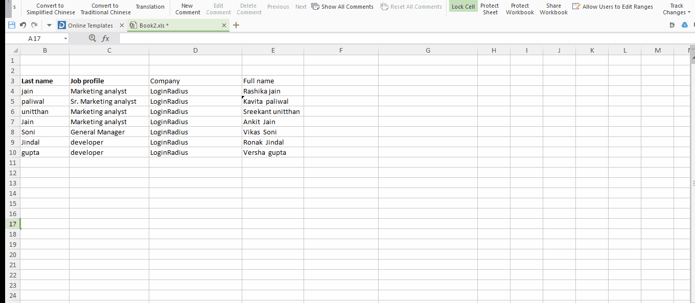
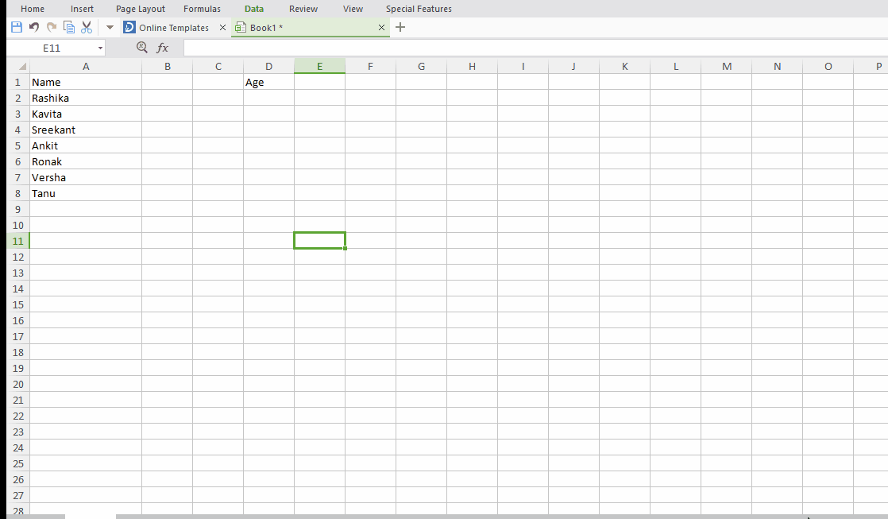
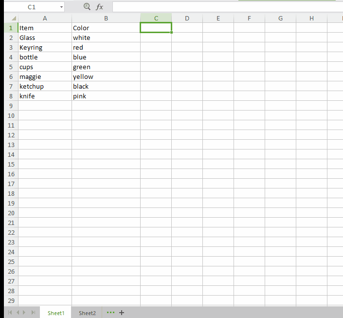

Sometimes Excel is much more than you have ever imagined. When it comes to manage tons of data values, you can’t ignore its stupendous capability that makes things easier for you.  All you need is a single formula and almost everything that you do manually can be done automatically.

You want to merge two spreadsheets with similar data? Wait, Excel has a formula for it. Do you want to merge two columns? Excel’s “&” symbol will serve you. Do you want to know complete status of your entire sheet at one go? MS Excel has a shortcut for it as well.

So you see almost everything that you can think of can be done in Excel with some simple shortcuts. There are many useful tips and tricks to save your time both as beginners and advanced users. So boost up your productivity with some amazing Excel Hacks that you  possibly are not aware of. Have a look!

### **Tip #1: Add a drop down list!**

Adding a drop down list will not only save you a number of rows but also prevent users to fill up a wrong value. Here is a quick explanation of how you can insert a drop down list in your excel sheet.

**Step #1:** select the cell where you want to appear your drop down arrow.

**Step #2:** Now from “Data” tab click on “Validation”**.**

**Step #3:**  Here in the “Allow” field, select “List” and type the cell source from where you are taking data to list, in my case it is from A10 to A16.

And here is your output:

### **Tip #2: Compose text with “&”:**

Database split out the data to show how exact it is. For example it never saves a person’s full name. They store the name in the form of first name and last name. So to combine such two columns, here is a simple Excel tip that uses “&” symbol.

Here is the formula: **“=A2&B2”** (where A2 and B2 are the cell sources)

To insert a space between these two composed value, the formula would look like: **\=A2&” ”&B2**

**Output:**

**Note :** To generate full names over a range of values simply drag the corner of that cell where you have written your formula and respective full names will appear in the covered cells.

### **Tip #3: Hide your formulas:**

When you click on a cell containing a formula, the formula appears at the top in the preview area next to function button which is no doubt helpful but it becomes messy when the formula is extra complex. So to give a neater look to your spreadsheet, here is an Excel trick that hides the formula and protects it from copying.

**Step #1:** Select the cell that has a formula, then right click and choose “Format cells” option.

**Step #2:** Under this “Format cells” window navigate to “Protection”.

**Step #3:** Here check the ”Hidden” box and press “ok”.

**Step #4:** Checking the hidden box won’t do anything if you have not protected your excel sheet. And to do this go to the “review” tab and click on “Protect sheet”.

**Step #5:** Here you will be prompted to create a password.

Create your password and make your formulas invisible.

### **Tip #4: Hide data thoroughly:**

“Hide Function” is known by everyone. Here is one more Excel hack to hide data thoroughly in your spreadsheet via using Format cells option**.**

**Step #1:** Select the data you want to hide.

**Step #2:** Right click and select format cells option or simply hit “ctrl +1”.

**Step #3:** From the box appeared like above, select custom and type “;;;” to hide your values from the column.

**Output:**

Note: The values will appear in the preview section next to the Function button.

### **Tip #5: Transpose your values**

Sometimes you have big rows and less columns. It gives readers a complex view of your Excel Sheet. Here you can convert your rows into columns and vice versa to have a sorted workbook. Here is a very simple Excel hack for this.

**Step #1:** Select the data cells you want to Transpose. Right Click and “Copy” entire data.

**Step #2:** select the cell where you want your output to appear and right click and choose“Paste Special” .

**Step #3:** Now in the “Paste Special” window check the “Transpose” option.

### **Tip #6 create your own shortcuts!**

Generally, there are only three options available on the top toolbar “Save, Undo and Redo”. You can also create your own shortcuts like print, copy, paste and many more. To set your own shortcut click on the drop down arrow in your toolbar and check whatever options you want to add. Here I am adding only copy and paste shortcuts in my toolbar.

### **Tip #7 Input values starting with 0!**

Though 0 before any number won’t make any sense, yet sometimes it required to add 0 before some given numbers. But our dear Excel won’t facilitate us with this “Adding a Zero before number” thing. So here is a hack to do this. Add a “single quote(‘)” before your zeros to enter them in a cell. Type **‘0009 to insert 0009** in your workbook**.**

### **Tip #8 : Vague search with Excel’s wildcard Character!**

In case of huge databases, chances are you want to search something specific. Definitely you won’t opt a manual scan to look for that specific thing. The in-built “Find(ctrl+f)” is there but what if you remember only some of its letters or numbers. For example you want to look for some states that end with “land”. For such queries Excel provides some wild card characters to complete your search query and give you your perfect matches.

In Excel “Question mark(?)”,  “Asterik(\*)”, and “Tilda(~)” are the wild card characters that are used to complete your search.

- **Question mark (?) :** can take a place of single character. For example “L?gs” matches with Logs, Legs but not with “”Lungs”

- **Asterik (\*) :  can take place of any number of characters. In the above example if we replace “?” with “\*” like “L\*gs” then it gives results that matches with Logs, Legs and lungs as well.**

- **Tilda (~) : It indicates that following character should be treated as a normal character not as a wildcard character. For example “L~?gs” will match with only “L~?gs”.**

### **Tip #9: Apply restriction on your input using Data Validation!**

Suppose you are running a survey on a group of people aged between 18 to 25. To maintain their records you surely want some restriction on their age inputs. First their age should be a whole number and second it must be between 18 to 25.

Excel has a data validation function to impose such restrictions on your input. Let see how to do it:

**Step #1:** Select “Data” tab and choose “Validation”.

**Step #2:** In the validation window under Settings section select Allow as “whole number” and fill other details as per your requirement.

**Step #3:** Next shift to “Input message” and type your error message here.

### **Tip #10: One click to get more status**

Do you know you can check the status of your excel sheet like sum, count, maximum value and many more with just a single click. Yeah, you can do it. Simply select the column you want check status for and the status will show in the bottom bar. You can customize the status as per your desire.

### **Tip #11: Usage of VLOOKUP Function!**

#### **Usage 1:**

VLOOKUP is a function of Excel that lets you find specific information in your spreadsheet. Suppose you have a big list of products and you want to know some specific information related to a particular product let’s say its color. Instead of manual lookup of the entire sheet which is no doubt very tedious, Excel has VLOOKUP function to help you.

The formula is: \=VLOOKUP(“lookup value”, table array, column number, \[range lookup\])

Let’s understand each term individually.

**Lookup value:**  This is the value for which you want to find specific information. In our example it is the name of the product.

**\=VLOOKUP(“cups”**

**Table array:** This argument is to hold the cell range that contains the data. In our example this will be A2:B8. And as with other functions, we use comma to separate each argument.

**_\=VLOOKUP(“cups”, A2:B8_**

**Column number:** This tells from which column in second sheet you want to pull data from. In our example it is the number of the column containing color of each product.

**_\=VLOOKUP(“cups”, A2:B8, 2,_**

**Range LookUp:** Use “False”.

**_\=VLOOKUP(“cups”, A2:B8, 2, FALSE)_**

#### **Usage 2:**

Sometimes it happens that you have item name and their specifications like color or category in a single sheet but their names and prices are stored in another sheet. Here VLOOKUP function can help you to merge both the sheets on a single condition that both sheets must have an identical column in both places.

The formula is: \=VLOOKUP(lookup value, table array, column number, \[range lookup\])

Let’s understand each term individually.

**Lookup value:**  This is the value that is common in both spreadsheets. Choose the first value from first sheet preferably. In our example this value is the very item name.

**\=VLOOKUP( A2,**

**Table array:** This will look something like this **sheet2!A2:B8.** “sheet 2” is the name of the sheet from where you want to pull data. "A2" is the column in sheet 2 which is identical in sheet 1 as well (In our case the column in sheet 2 containing item names).(In our case the column in sheet 2 containing name of the employees). “B” is the column containing the information you want to merge in sheet 1. Basically, A2:B8 defines the range you want to pull data from.

**Column number:** This tells from which column in second sheet you want to pull data from. In our example it is the number of the column containing leave count of each employee.

**Range LookUp:** Use “False”.

Well, these are some amazing Excel tips that you can use in your daily data records. Excel is too good to be true and one can not be fully understood in one go. I hope this article would help you at some extent. And do not forget to drop your experiences in the comment box below.
