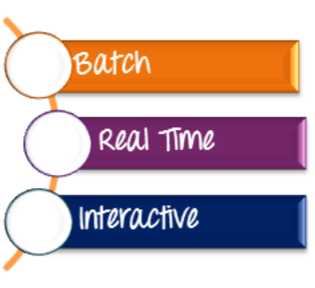
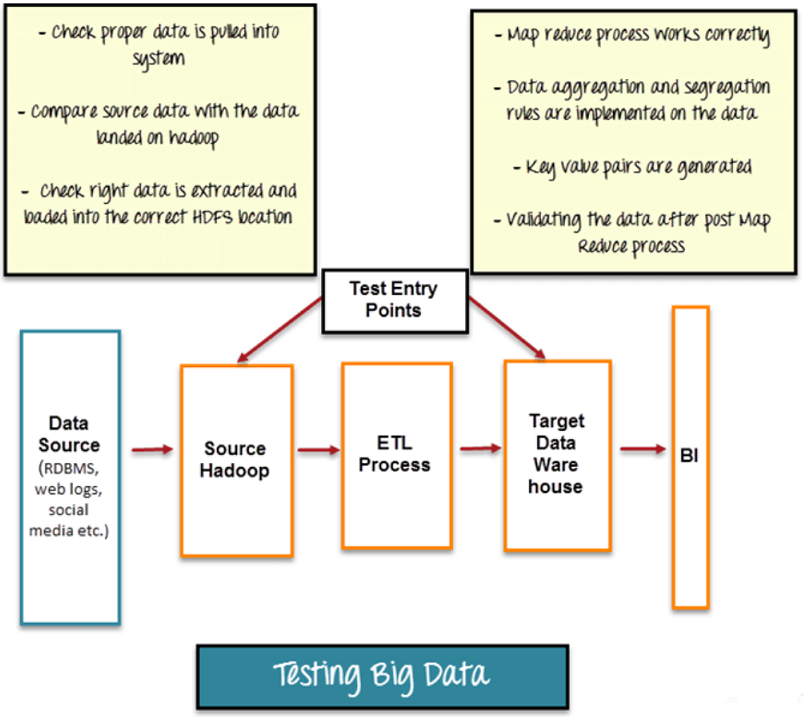
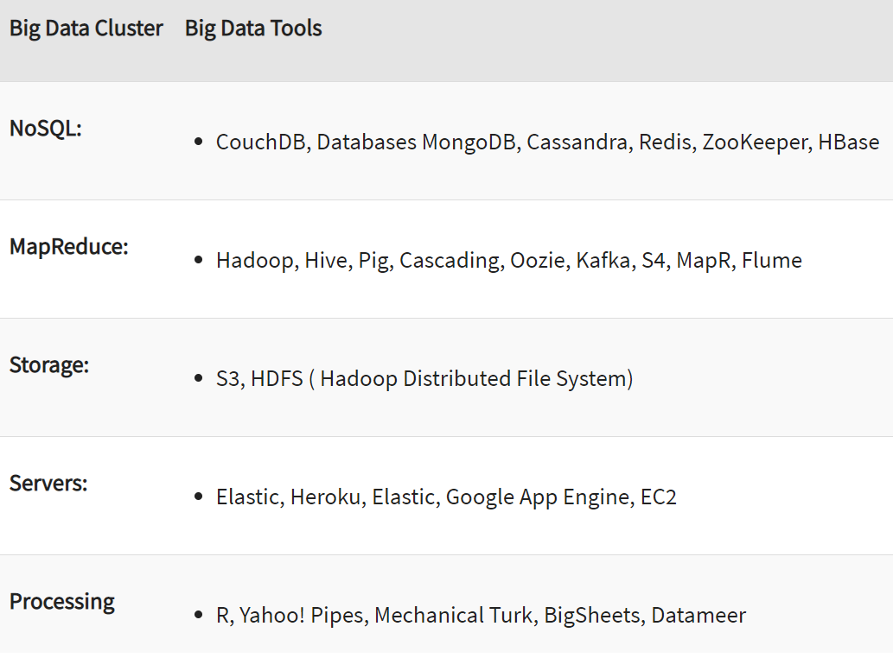

## Big Data - Introduction

Earlier, we were only dealing with well-structured data, hosted in large data warehouses, and investing a cost in maintaining those data warehouses and hiring expert professional to maintain and secure information hosted in that data warehouse. Data was structured and can be queried anything as per the needs. But now, this exponential growth of data generates a new vision for data science along with some major challenges.

**Big Data** is something which is growing exponentially with time, and carry raw but very valuable information inside that can change the future of any enterprise. It is a collection, which represents a large dataset, may be collected from multiple sources, or stored in an organization.
Let‟s understand a real-time example, Big companies like Ikea and Amazon are leveraging the benefit of big data by collecting data from customer‟s buying patterns at their stores, their internal stock information, and their inventory demand-supply relations and analyze all, in seconds even in real-time to add value to its customer experience.

So, extracting information from a large dataset somewhat calls a concept of Data mining which is an analytic process originally designed to explore large datasets. The ultimate goal of data mining is to search for consistency in a pattern or systematic relationship between variables, which helps in predicting the next pattern or behavior.

Now, if we take concepts of data mining forward along with large data set, to some extent it becomes a blocker for our existing approach, because big data may contain structured or unstructured data even it may contain data in multiple formats also.

## Big Data Testing

Testing is an art of achieving quality in your software product, in terms of perfection of functionality, performance, user experience, or usability. But for big data testing, you need to keep your focus more on the functional and performance aspects of an application. Performance is the key parameter in any big data application which is meant to process terabytes of data. Successful processing of terabytes of data using a commodity cluster with a number of other supportive components needs to be verified. Processing should be faster and accurate which demands a high level of testing.

Processing may be of three types:–

And based on which, we need to integrate different components along with NoSQL data store as per the needs.

## Big Data Testing - Test Data

Data plays a vital role in the testing of big data applications. Application is meant to process data and provide an expected output based on implemented logic. The logic needs to be verified before moving to production, as the implementation of logic is completely based on business requirements and data.

**1. Test Data Quality**

Good quality test data is as important as the test environment. In the big data world, data can have any format or size, it may be in the form of a document, XML, JSON, PDF, etc. at the same time data size may go up to terabytes of petabytes. Hence, test data should also have multiple formats and size should be large enough to ensure the handling of large data processing. In big data testing, it needs data with logical values as per the application requirement and format which is supported by the application.

Along with it, data quality is another aspect of big data testing. Ensuring the quality of data before processing through application ensures the accuracy of the final output. Data quality testing itself is a huge domain and covers a lot of best practices which include – data completeness, conformity, accuracy, validity, duplication, and consistency, etc. It should be included in the big data testing and this ensures the level of accuracy application is supposed to provide.

**2. Test Data Generation**

The generation of test data is again a challenging job, there are multiple parameters, which have to be taken care of while generating test data. It needs a tool, which can help to generate data and should have functions or logic can also be applied over it. Tools like Talend (an open studio) is the best candidate to fulfill the requirements of data generation.

**3. Data Storage**

After the generation of test data along with quality, it needs to host on a file system. For testing big data applications, data should be stored in the system similar to the production environment. As we are working in big data space, there should have a different number of nodes, and data must be in a distributed environment.

## Big Data Testing - Test Environment

In Big data testing, the test environment should be efficient enough to process a large amount of data as done in the case of a production environment. Real-time production environment clusters generally have 30-40 nodes of cluster and data is distributed on the cluster nodes. There must have some minimum configuration for each node used in the cluster. A cluster may have two modes, in-premise or cloud. For testing in big data, it needs the same kind of environment with some minimum configuration of node.

Scalability is also desired to be there in the test environment of big data testing, it helps to study the performance of application with the increase in the number of resources. That data can be used to define SLA (service level agreement) for that particular application.

**Big Data Testing can be categorized into three stages:**

**Step 1: Data Staging Validation**

The first stage of big data testing, also known as a Pre-Hadoop stage, is comprised of process validation.

1.  Validation of data is very important so that the data collected from various source like RDBMS, weblogs, etc are verified and then added to the system.
2.  To ensure data match you should compare source data with the data added to the [Hadoop](https://en.wikipedia.org/wiki/Apache_Hadoop) system.
3.  Make sure that the right data is taken out and loaded into the accurate HDFS location

**Step 2: “Map Reduce” Validation**

Validation of “Map Reduce” is the second stage. Business logic validation on every node is performed by the tester. Post that authentication is done by running them against multiple nodes, to make sure that the:

- The process of Map Reduce works perfectly.
- On the data, the data aggregation or segregation rules are imposed.
- Creation of key-value pairs is there.
- After the Map-Reduce process, Data validation is done.

**Step 3: Output Validation Phase**

The output validation process is the final or third stage involved in big data testing. The output data files are created and they are ready to be moved to an **EDW (Enterprise Data Warehouse)** or any other such system as per requirements. The third stage consisted of:

- Checking on the transformation rules is accurately applied.
- In the target system, it needs to ensure that data is loaded successfully and the integrity of data is maintained.
- By comparing the target data with the **HDFS file system data**, it is checked that there is no data corruption.

## Big Data - Performance Testing

Big data applications are meant to process a large amount of data, and it is expected that it should take minimum time to process maximum data. Along with it, application jobs should consume a considerable amount of memory and CPU. In big data testing, performance parameter plays an important role and helps to define SLA's. It covers the performance of the base machine and cluster. Also, for example, In the case of Hadoop, map-reduce jobs should be written with proper coding guidelines, to perform better in the production environment. Profiling can also be done on map-reduce jobs before integration, to ensure their optimized execution.

## Tools used in Big Data Scenarios

## Big Data Testing - Challenges

In big data testing, certain challenges are involved which needs to be addressed by the big data testing approach.

**1. Test Data**

Exponential growth had been observed in the growth of data in the last few years. A huge amount of data are being generated daily and stored in large data centers or data marts. So, there is a demand for efficient storage and a way to process it in an optimized way. If we consider the telecom industry, it generates a large number of call logs daily and they need to be processed for better customer experience and compete in the market. The same goes with the test data, test data should be similar to production data and should contain all the logically acceptable fields in it.

This becomes a challenge for testing big data application, generating test data similar to production data is a real challenge. Test data should also be large enough to verify proper working big data application.

**2. Environment**

The processing of data highly depends on the environment and its performance. An optimized environment setup gives high performance and fast data processing results. Distributed computing is used for the processing of big data which has data hosted in a distributed environment. The testing environment should have multiple numbers of nodes and data should be distributed over the nodes. At the same time, it also needs to monitor those nodes, to ensure the highest performance with minimum CPU and memory utilization. Nodes should be monitored and there should have a graphical presentation of node performance. So, the test environment has two aspects – distributed nodes and their monitoring, which should be covered in the testing approach.

**3. Performance**

Performance is the key requirement of any big data application, and of course because of which enterprises are moving towards NoSQL technologies, technologies that can handle their big data and process in the minimum time frame. A large dataset should be processed in a minimum considerable time frame. In big data testing, performance testing is a challenge, it requires monitoring of cluster nodes during execution and also time is taken for every iteration of execution.

## Conclusion

Big Data is the trend that is revolutionizing society and its organizations due to the capabilities it provides to take advantage of a wide variety of data, in large volumes and with speed. Keeping the challenges in mind we have defined the approach of testing big data applications. This approach of big data testing will make it easy for a test engineer to verify and certify the business requirement implementations and for stack holders, it saves a huge amount of cost, which has to be invested to get the expected business returns.
