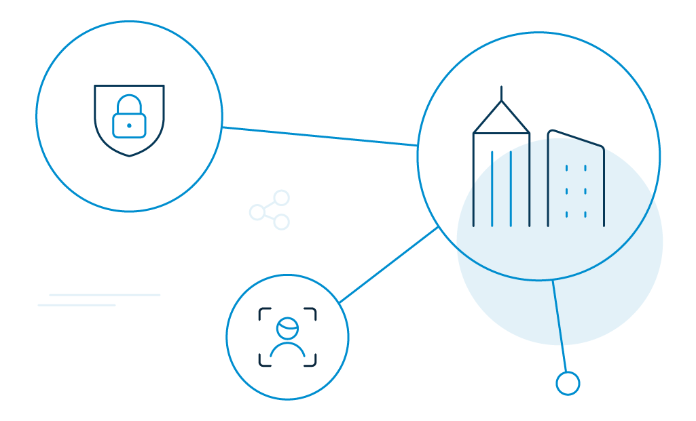

The influx of unprecedented amounts of data in the hands of product teams only started a decade ago.

Cut to ten years later, the world has undergone a massive transformation in governing the data and is establishing methods to standardize, integrate, and protect such information.

The EU's General Data Protection Regulation implemented in 2018 was a masterstroke to the data governance arrangement. It fundamentally changed how companies interact with customer data and their understanding of the need to:

- Minimize the risk of [data theft](https://www.loginradius.com/blog/2020/05/cyber-threats-business-risk-covid-19/).
- Establish strategic rules for the use of data.
- Implement data compliance.
- Maintain the communication flow, both internally and externally.
- Increase the value of data.
- Reduce expenses.
- Ensure the continued existence of a company via risk management.

Your data assets are the key metrics that can make or break your business. So, let’s find out if your data management practices are as good as it should be.

First.

## What Is Data Governance and Why It Is Important for Your Business

Data governance usually affects the tactical and operational levels in most enterprises. It is a set of laws implemented within an organization to decide the authority and control over data assets.

Data governance involves agreed-upon models and encompasses the people, processes, and technologies that describes who can take what actions, under what circumstances, and how data assets may be used.

Digital transformation is realigning how people conduct business with data being one of the key assets that dictate and decide a company's performance. Only when you can control your data can you leverage your data assets and make an effective [digital transformation](https://www.loginradius.com/blog/2018/11/enterprise-needs-digital-business-transformation-strategy/).

Deploying a data governance system that suits the company and its potential business goals makes it easier for employees to align and work together towards achieving it.

## Predictions for Data Governance in the Next Decade

The world created 1.2 zettabytes (1.2 trillion gigabytes) of new data in 2010. The amount is estimated to grow by 44 times and reach [35 zettabytes in 2020](https://www.seagate.com/files/www-content/our-story/trends/files/idc-seagate-dataage-whitepaper.pdf). This led the IDC to predict that the world will create 175 zettabytes (175 trillion gigabytes) of new data in 2025. And that's a MASSIVE number!

Data will continue to drive innovation, break boundaries, and create new concerns for day-to-day business operations in the years to come. No wonder, it has already led to the subsequent implementation of new data governance laws around the world.

The following are a few predictions concerning data governance around the world.

### A radical shift in roles and responsibilities.

As the world witnessed a major paradigm shift in the digital landscape, more and more companies are adopting robust data governance practices into their organizational framework.

Of late, there has been a cultural shift to a data-centric approach from the existing campaign-centric one. This is beginning to make rooms for new roles and responsibilities like that of a Chief Data Officer (CDO) in companies that look to associate with a data-driven world.

### The changing data privacy ecosystem.

The digital world has everything to do with creating, storing, and sharing data constantly. So no, it isn't wise to implement simple guidelines and standards to cover multiple circumstances. Data governance professionals recognize how we are at the epicenter of data creation, and a single decision has the power to make or break a business.

The coming decade will witness privacy regulations becoming more stringent—the EU's GDPR and the [California Consumer Privacy Act (CCPA)](https://www.loginradius.com/blog/2019/09/ccpa-vs-gdpr-the-compliance-war/) are examples of the new revolution in the making. These laws focus on the individual and the consumer experience at a granular level for data officers to take the cue.

### The foundation of customer experience

Data governance will be at the center of customer and business relationships. Today, there are a plethora of channels - AR/VR, AI, cross-platform, omnichannel (to name a few) to connect the latter with their customers. But the only way to understand customer experience and converse with them, in general, is through data.

Needless to say,  data governance will emerge as a competitive differentiator when delivering the best customer experiences.

## Data Governance Best Practices Enterprises Should Follow

You need to take care of a lot of things while handling a [data governance program](https://www.loginradius.com/data-governance/). For example, you need to hire the right people around you who can handle your data and invest in the right data management platform to get the best security.

Similarly, below are a few data governance best practices you should follow:

### Figure out the operating model.

The operating model is the foundation of any data governance program. You need to figure out your enterprise's governance structure and define the roles and responsibilities to solve data programs as one unit. Ideally, there could be three kinds of structure.

- Centralized - When there is a central authority to manage everything.
- Decentralized - When there is a group of authorities to manage everything.
- Federated - When there are independent or multiple groups to manage everything with little or no shared ownership.

### Identify opportunities and benefits.

Try to figure out the good that data governance may bring to your organization. When you know the benefits, you can use it to your advantage and plan your strategies according to the desired outcome.

It can significantly help you get buy-ins from upper-level management and also from those that handle data at all organization levels.

### Narrow down your data domains.

Most data domains contain artifacts like data owners, business processes, data and report catalogs, data dictionaries, systems and applications, policies and standards, data quality scorecards, and the likes. Depending on the type of industry, you need to determine these domains for every line of business.

Mostly, the identification of a data domain starts with a problem. It can be the urge to increase [customer experience](https://www.loginradius.com/blog/2019/11/improve-customer-experience-ecommerce/), manage customer usage, increase upsell, or the need to validate a customer requirement.

### If it gets intimidating, start small.

Data governance involves complex systems, an intriguing group of people, and above all, large amounts of data. So, if you want to go long, start small.

Identify a data crisis in one business area and expand from there. Likewise, you can also break more extensive programs into smaller ones and conduct test processes before going big.

After the initial success, as you move to the next program, your process will be more streamlined, efficient, and cost-effective.

### Data governance is not just about data, but people too.

Establish secure communication at every stage of creation and implementation for your data governance plan to work and get more buy-ins. So, next time you plan a new strategy, make sure to communicate about its benefits.

It is also essential that the group responsible for implementation communicates the participant's roles explicitly in the data management strategy.

### There are more regulations in the making.

The world is coming in terms with the [compliance](https://www.loginradius.com/compliances-list/) defined by popular regulations like the GDPR and the CCPA. They completely changed the way companies do business, and how people perceive data protection.

Following suit, other countries like India, South Korea, Brazil, and Thailand are on the verge of joining the global movement for stricter data protection laws.

## How Does a Robust Data Governance Framework Impact Your Digital Business

Digital transformation is actively on the radar of data security professionals. A well-thought and proactively managed data governance framework can drive business transformation throughout organizational levels in the following ways:

- **Production**: It helps in deploying automation.
- **Procurement and Supply Chain Management**: It reduces cost and induces operational efficiency.
- **Sales and Marketing**: It offers customer preferences and behavioral insights.
- **Management**: It ensures the overview of corporate data assets and the changing market opportunities.
- **Finance**: It offers consistent and accurate reporting.
- **Legal and Compliance**: It provides a decent way to meet the
- Growing international regulatory requirements.

## Choosing the LoginRadius CIAM Platform to Help Enterprises

Data governance isn’t a one-time project, rather a recurring one. To maintain and sustain such programs require a lot of work. LoginRadius is a customer identity and access management (CIAM) platform that prepares organizations to fuel data-driven decision-making and create better business opportunities.

The CIAM solution allows only authorized employees to access and manage customer data, so there's a lesser chance of accidental data leak. Among the global standards, it adheres to include the GDPR and the CCPA. Moreover, it supports [global regulatory compliances](https://www.loginradius.com/blog/2020/06/consumer-data-privacy-security/) to deliver a seamless customer experience.

A few of the certifications include:

- **ISO 27001:2013** – For information security management system.
- **ISO 27017:2015** – For information security for cloud services.
- **ISO/IEC 27018:2019** – For the protection of PII.
- **US Privacy Shield** – Complaint resolution for EEA citizens.
- **PCI DSS–PCI SSC** – For secure payment transactions.
- **ISAE 3000** – For the protection of non-financial information.
- **NIST Cybersecurity Framework** – To reduce cybersecurity risk.
- **AICPA SOC 2 (Type II)** – For security, availability, process integrity, confidentiality, and data privacy.

## Conclusion 

As already mentioned, data governance revolves around people, processes, and technology. You need to stay on top of the changing regulations and management practices to sustain the shifting competition.

Maximize benefits and optimize your use of data protection strategies in the new decade. Start with implementing the data governance best practices laid out in this article.

