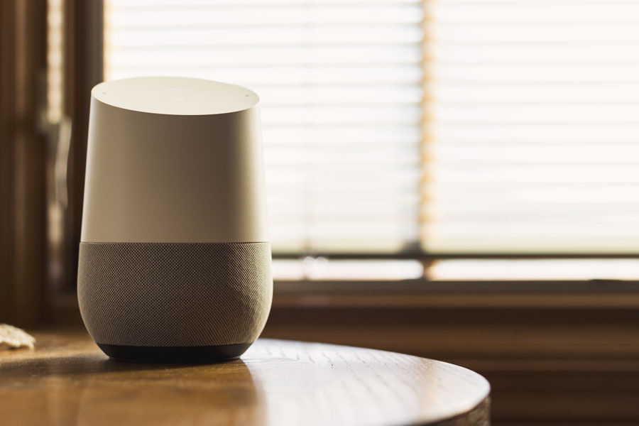

When you think of online customer experience, you might not consider it as important in the public sector. But with so many daily services now available online, companies and organizations in the public sector are constantly looking for ways to provide customers with the best experience possible. Not only that, but certain organizations such as government agencies, NGOs, and education systems are often faced with the need to conserve money and limit setup time.

Implementing a [customer identity and access management](https://www.loginradius.com/blog/2019/06/customer-identity-and-access-management) (CIAM) solution can help tackle both issues at once. LoginRadius is currently helping a number of companies in the public sector improve their customer experience in different ways. Here are some examples of how public sector sub-industries improve their customer experience with LoginRadius.

## Cities: Centralizing Municipal Services

In an effort to increase citizen engagement, [more and more cities are moving citizen services to their online platforms](https://www.loginradius.com/resource/how-cities-use-loginradius-identity-platform/). Paying taxes, obtaining a business license, getting election information, and more can all be done online through a centralized portal. Simplifying access to these services by creating a one-stop resource for all online applications increases not only citizen engagement, but also satisfaction with government and municipal services in general.

The [City of Surrey](https://my.surrey.ca/), British Columbia has implemented the LoginRadius CIAM solution to provide a centralized hub for an extensive list of citizen services. They also enable users to access each service with a unified identity through [single sign on authentication](https://www.loginradius.com/single-sign-on-overview/), avoiding the need to register or log in multiple times for different services. SSO further improves customer experience with their digital platform by creating seamless interactions across each different service.

## Non-Profits & NGOs: Informing Centralized Groups

Much like cities, many NGOs and non-profit groups depend on interacting with citizens in order to inform them about various initiatives. Without the ability to reach and inform large groups of citizens, these organizations are rendered ineffective. With this communication need in mind, a positive customer experience with their digital properties is extremely important, as it can help in extending the reach of these initiatives, as well as turning online visitors into known users. From there, these groups can individually target the various groups of people they need to interact with.

For example, [Zero Waste Scotland](https://www.youtube.com/watch?v=_11VIYMZh2g&list=PL3PS687CKFEFv2nlnk6NKrmbg4_zwBImw&index=3) is a government non-profit organization that promotes the government’s policy on waste and resources. With a range of users and stakeholders to reach, they needed a CIAM solution that could easily allow these various identities to interact with their multiple digital touchpoints. LoginRadius was able to build centralized profiles for each user in order to gain a complete view of how people are using their services. Leveraging our User Profiling capabilities has helped Zero Waste Scotland and other organizations understand their users and build informed campaign strategies.

Lastly, when it comes to government agencies like Zero Waste Scotland, data security is one of the main priorities, especially with cloud storage. LoginRadius complies with all major security regulations in the industry, including [GDPR](https://www.loginradius.com/resource/loginradius-and-gdpr-compliance/). We also allow customers to choose which of our 29 global data centers they want personal data to be stored in, to comply with company policies.

## Utilities: Bringing Better Information to the Customer

For most people, a utility provider represents just another bill to pay at the end of the month. Customers are often limited in the ways that they can interact with utility companies, making customer experience an afterthought. With a CIAM solution, [utility companies can transform their customer experience](https://www.loginradius.com/resource/how-utility-companies-use-loginradius-identity-solution/) by integrating with third-party applications. These integrations help them better understand their customers, offer more useful information, and deliver that information more directly.

One of the best examples of customer experience innovation for utilities comes from Hydro Ottawa, the largest local electricity distribution company in eastern Ontario. LoginRadius has helped [Hydro Ottawa completely disrupt the Canadian utility industry](https://www.loginradius.com/blog/2018/10/customer-spotlight-hydro-ottawa/) by integrating their platform with Amazon Alexa and Google Home. Customers can receive billing information, insights about usage, and tips on how to conserve energy and reduce spending by talking to their smart home assistant. Now, rather than making customers search for useful information, Hydro Ottawa makes that information directly available through voice commands. By leveraging their identity architecture and the [OAuth 2.0](https://www.loginradius.com/federation/) capabilities from LoginRadius, Hydro Ottawa has developed a new and innovative way for their customers to interact with them.

If you’re ready to see how the LoginRadius CIAM platform can help your company, [schedule your demo now](https://www.loginradius.com/schedule-demo/).
