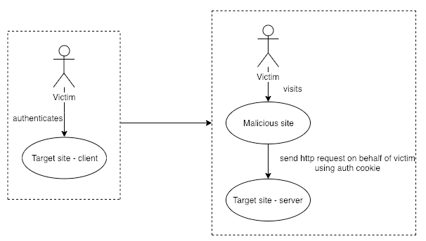
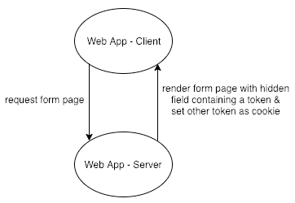
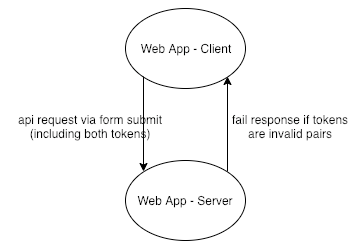

**Introduction**

Cross-Site Request Forgery (CSRF) is a common web application attack where a victims’ authenticated session becomes compromised. This attack essentially tricks a victim into performing unintended tasks on a website they are authenticated in. There are variations to this attack, and a popular one we will discuss is utilizing authentication token to imitate api requests.

**Context**

In order to understand CSRF, it is important to know how cookies and authentication tokens are used for persisting user sessions. Cookies are information stored in the browser, and often used for managing state between HTTP requests. A key feature of cookies is that they are automatically passed as a header in HTTP requests. Authentication tokens are typically stored as cookies, and are a way to keep track of a users’ authenticated session. These tokens are set as cookies after a user successfully authenticates themselves by log in.

**How it works**

CSRF takes advantage of the storage of auth tokens in the browser, and constructs http requests to a target server on behalf of the user. Imitating http requests from the legitimate site requires research and preparation from the attacker beforehand, such as finding vulnerable websites and api’s suitable for the attack.

Here is a high-level example of an CSRF attack. Note that some details are excluded for simplicity, but the key aspects are included.

1. John is authenticated on banking.io
    - Auth token is set as a cookie on the browser.
2. On another tab, John clicks on an advertisement for free money, which leads to a malicious site.
    - Typically, some social engineering is necessary to lure victims to a malicious website.
3. Malicious site makes a POST request to banking.io/setpassword, which is an api for setting a users password to anything.
    - The malicious site will construct the POST request for setting password exactly like the legitimate site, and uses John’s authentication cookie.
    - The password will be set to anything the attacker wants.
4. Victim is unable to authenticate with banking.io anymore, because the password was set to something else.

**Mitigation**

A common and effective way of mitigating CSRF is called the double submit cookie. Essentially the client will have two paired and encrypted tokens: one hidden in the page HTML and the other stored as a cookie.

When a request is made by the client, both tokens are sent to the server, and the server will then ensure the tokens are valid pairs before processing the request as normal. 

Now the attacker will be unable to perform CSRF since they will not have access to the token hidden in the pages HTML, and the target server requires a valid token pair before processing the request.

There are also many other mitigation techniques, such as using the Same-Site cookie attribute, and requiring user interaction such as CAPTCHA for requests. Learn more on the [OWASP wiki](https://www.owasp.org/index.php/Cross-Site_Request_Forgery_(CSRF)).
