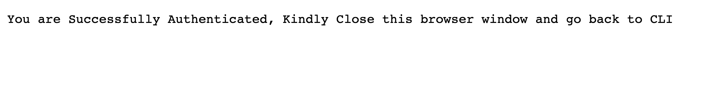

Using the LoginRadius CLI, you can perform basic actions of your LoginRadius Dashboard through command line. The actions includes login, register, logout, email configuration, domain whitelisting etc. Once the actions are performed, changes will be reflected in your application. 


## Installation of LoginRadius CLI

LoginRadius CLI is available for installation via Homebrew and downloadable binaries. It provides support for MacOS, Linux and Windows users. To setup LoginRadius CLI, please refer to: [LoginRadius CLI](https://github.com/LoginRadius/lr-cli/tree/v0.1.0)

## Configure LoginRadius using CLI

Once you have the CLI installed, the following base commands can be used instead of accessing the dashboard to setup your LoginRadius account. 

- To register an account: `lr register`
- To Login to an account: `lr login`
- To Logout of an account: `lr logout`
- To obtain API Key/Secret: `lr get config`

Start with the `lr register` command to create a new account from CLI or use `lr login` if you already have an account. **Please note**, the `register` and `login` commands will open a new tab in your browser. If the login/register action has been performed successfully, the following message will be visible in the browser tab.



Return to the CLI and check if Login confirmation is received as shown below. If yes, move on to the next step. 

```shell 
2021/04/06 13:50:19 Successfully Logged In

```

## React Demo Steps

### Clone Demo Repository

A **Demo React Application** will be used for the purposes of this blog. To clone the repository visit: [LoginRadius React Demo]() 

### Preparing the Demo

After cloning the repository, navigate to _____. Run the `lr get config` command to obtain the API Key/Secret and add it as shown below.

---------------xxx-------------

Use the `npm run start` command to start the React application.  

## Additional Features

Several other commands are available via LoginRadius CLI. Please refer the [LoginRadius CLI Manual](https://www.loginradius.com/open-source/cli/manual)) to learn more about these commands and their use cases.

### Social Configuration

LoginRadius offers Social Configuration with **Facebook, Google and Twitter** for your applications via LoginRadius Free Developer plan. 

- To **Add** a social provider run: `lr add social --provider --ProviderKey --ProviderSecret`([Command Explanation](https://www.loginradius.com/open-source/cli/manual/lr_add_social)). To setup the Provider Key/Secret refer the [guide](https://dashboard.loginradius.com/configuration) on LoginRadius dashboard.
- **Verify** that the social provider has been setup by using the `lr get social` command. 
- The changes made will reflect in the page as shown below. 
---------xxxx--------------
- To **Delete** the social provider use the `lr delete social --provider` command ([Command Explanation](https://www.loginradius.com/open-source/cli/manual/lr_delete_social))

## Recap

In this tutorial, we have covered basic functionalities like **login, register and config** that can be performed via the LoginRadius CLI. Some advanced commands like **Social configuration** were also touched upon. A React Demo application was used to exhibit the workflow of these commands. 
Apart from these, the LoginRadius CLI has plenty of commands with a wide range of use cases to make life easier for the developer community while working with LoginRadius software. Currently, only the **LoginRadius Free Developer plan** is supported by the LoginRadius CLI but we plan to expand the project to other plans soon! Let me know if this tutorial was helpful in the comments below. 
Thanks for reading :) 

## Resources 

- To contribute, LoginRadius CLI Open source Repository: https://github.com/LoginRadius/lr-cli
- LoginRadius CLI Manual: https://www.loginradius.com/open-source/cli/manual
- React Demo Application: 


