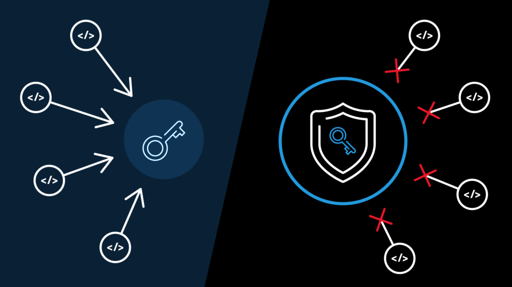
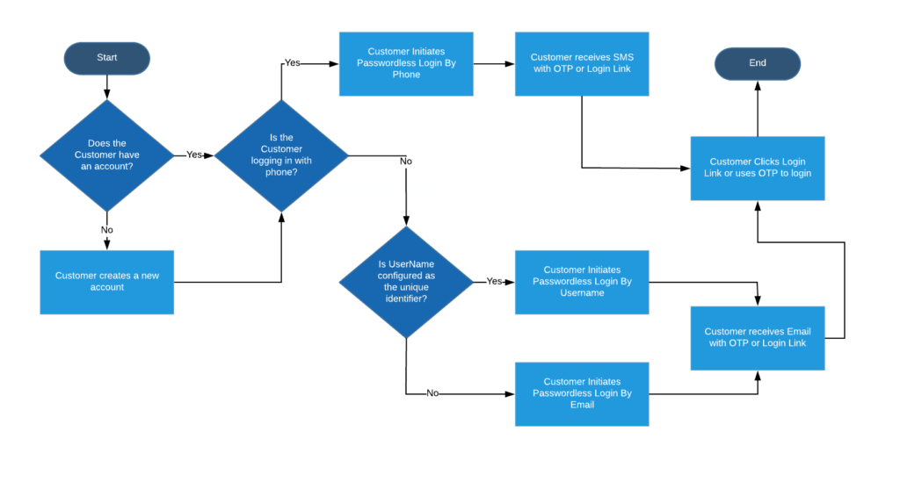

When it comes to online security, the battle cry among experts lately is: “The future is passwordless!” So, why is passwordless authentication so important?

Simple. Passwords are just too easy to guess, hack, or intercept. What’s more, the legacy of password reuse is leading to constant [attack and account vulnerabilities](https://www.loginradius.com/blog/2019/09/prevent-credential-stuffing-attacks/).

However, modern-day passwordless authentication goes beyond the use of password and username credentials.

So, whether your organization wants to replace passwords or is determined to keep using them, you must first [understand password weaknesses](https://www.loginradius.com/blog/2019/12/worst-passwords-list-2019/). Here are a few:

- Users often create weak passwords that are vulnerable to phishing attacks.
- Hackers commonly use brute force attacks to hack password credentials.
- Users often reuse the same authentication credentials on different accounts.
- Password methods alone cannot keep hackers away.

Remember that we’re not dealing with bored, out-of-work hackers playing for thrills. Rather, these are often well-established criminal organizations using high-end machine learning (for _big_ profit).

## What is Passwordless Authentication?

A passwordless authentication system is one that swaps the use of a traditional password with [more secure factors](https://www.loginradius.com/authentication/). These extra-security methods may include a magic link, fingerprint, PIN, or a secret token delivered via email or text message.

## Why Do We Need Passwordless Authentication?

Passwordless login [eliminates the need to generate passwords](https://www.loginradius.com/passwordless-login/) altogether. There’s a lot of good in this new-age process for both users and organizations alike.

For users, since one need not type passwords anymore, it leads to a better screen time experience. While for organizations, it will [lead to fewer breaches](https://www.loginradius.com/blog/2020/05/cyber-threats-business-risk-covid-19/) and support costs.

The good news is that the list doesn’t stop here. Let’s learn more.

### Passwordless Login for Businesses

The use of passwordless authentication in businesses is multifold. For example, you can go passwordless for internal security, online consumers, or even combine the two of them.

A few use cases of passwordless authentication include:

- Sign up for a service, or get a subscription.
- Let consumers log in to their online accounts.
- Make a secure payment online.

With passwordless login, it is much easier to keep information about your users safe and implement tighter [security measures for your employees](https://www.loginradius.com/security/).

### Passwordless Login for Non-Profits

Speaking of non-profit organizations, passwordless authentication can do wonders to the security of the donation process.

Also, when a person donates to an NGO, they can have their payment information like name, card details, expiry dates etc. saved using passwordless options like email authentication. So the next time they plan to donate, they won't need to fill in the basic information.

## Benefits of Passwordless Authentication

- **Improved user experience**: Be it fingerprint scanning, social media sign-in, [PIN authentication](https://www.loginradius.com/blog/2020/04/loginradius-pin-based-authentication/), or email verification, you no longer need to memorize any credentials whatsoever.   
    
   Passwordless authentication only takes a few basic steps and works on both websites and mobile applications alike.

- **Increased cost-effectiveness**: Passwords require constant maintenance. According to Forrester, the [average cost of one password reset](https://blog.lastpass.com/2018/05/new-forrester-report-real-cost-password-risks.html/) for a company is $70. For large enterprises, this figure reaches $1 million USD each year.   
    
   Needless to say, eliminating passwords will not just save time and productivity, but also a bulk load of expenses.

- **Stronger security**: User-controlled passwords are vulnerable to attacks like phishing, credential stuffing, brute force attacks, [corporate account takeover (CATO)](https://www.loginradius.com/blog/2020/04/corporate-account-takeover-attacks/), and more.   
    
   So, when there is no password to hack in the first place, those vulnerabilities will automatically decrease.

- **Greater convenience**: Since users can authenticate without passwords, it becomes easier to sign in and access data from anywhere on the web.

- **IT Gains Control and Visibility**: Phishing, reuse, and password sharing are just a few of the issues related to password-based authentication.  
    
   So, when there is no need for passwords in the first place, IT can reclaim its purpose of having complete visibility over [identity and access management](https://www.loginradius.com/blog/2019/06/customer-identity-and-access-management/).

## What Does Passwordless Authentication Prevent

With passwords out of the picture, the following are a few attacks that businesses can dodge by implementing passwordless authentication into their systems.

1. **Password spraying**: It is a method of cyber-attack that attempts to log in to a large number of accounts with commonly used password credentials.
2. **Brute Force Attack**: Hackers use the trial-and-error method to guess the login credentials or encryption keys. They try all the possible combinations until the account is hacked.
3. **Spear phishing**: It is an email spoofing attack that scams organizations and individuals to give away sensitive credentials for financial, military, or trade gains.
4. **Social Engineering**: Hackers use psychological manipulation and scam users into giving away sensitive information or granting access to critical resources.
5. **Shoulder Surfing**: It is a type of data theft where the intruder steals login credentials by peeking over the target's shoulder.

## How Safe Is Passwordless Authentication as Compared to Other Login Methods

A common issue with using passwords for authentication lies in the fact that customers want the quickest way to log in to their accounts. After all, the longer it takes for a consumer to sign-up, or make a purchase, they will more likely tend to bounce. Other reasons why passwords bounce include:

- **Password complexity is weak**: Passwords may meet the standard complexity, but they may be still weak because of password dictionaries.
- **Password follow patterns**: Because the majority of passwords follow a certain pattern, it is easier for hackers to commit data theft.
- **Passwords aren’t unique**: People reuse passwords and newly leaked dictionaries contain previously leaked passwords.

Due to [bad password practices](https://www.loginradius.com/blog/2018/12/infographic-the-death-of-passwords/), chances are consumers may be putting their accounts at risk. This is one of the strongest reasons why passwordless authentication is preferred by consumers and enterprises as their preferred method of authentication.

## Types of Passwordless Authentication

In a typical application, passwordless authentication can be implemented through different approaches. Here’s a list of the most common ones.

### Email-Based Passwordless Authentication

This is one of the most common login systems. The user is asked to enter the email address. A unique code (or magic link) is then created and sent to the associated email ID. When the user clicks on the link, the server triggers an action to verify if the code is valid within a certain timeframe (e.g. three minutes) and then swaps it for a long-time validation token. If the authentication is successful, the user is let in.

### Social Login Authentication

[Social login is the method of authentication](https://www.loginradius.com/social-login/) using a social network provider like Facebook, Twitter, or Google. The user enters your application and selects a social network provider. A login request is then sent to the provider and after the provider approves it, the user is allowed to access their application. There is no need for passwords at all.

### SMS-Based Passwordless Login

Here’s a convenient, easy-to-implement way to onboard a user. SMS-based login eliminates the need to create additional credentials, thereby easing the basic authentication process. The steps are simple: A user must enter a valid phone number; then the server sends a single-use code to that number which the user must enter to log in to the service.

### Biometrics-Based or Passwordless Authentication for Logged-In Users

Biometric authentication services focus on growing technologies like fingerprint, face, or iris scans. The technology works on smartphones where users press their thumbs on their smartphone scanners to authorize their identities and gain access to their accounts. Both Android and Apple offer biometric login options that are popular for their convenience.

## How Does Passwordless Authentication Work

The technology behind passwordless login is similar to that of digital certificates. There are [cryptographic key pairs](https://en.wikipedia.org/wiki/Cryptographic_key_types) that include a private and public key.

To understand how this works, think of the public key as the padlock. The private key, on the other hand, is what unlocks the padlock. To sum up, there is only one key for the padlock and in return, one padlock for the key.

This means that whenever a user wishes to create a secure account, a public-private key pair must be generated. This is usually done via tools like a mobile app or a browser extension. Here are the steps:

- A private key is stored on the local device of the user and linked to an authentication factor like a PIN, fingerprint or face recognition.
- The public key, on the other hand, goes to the website or application where the user wishes to log in.

Today’s passwordless authentication follows the [FIDO2 standard](https://en.wikipedia.org/wiki/FIDO2_Project). It includes WebAuthn and CTAP that help organizations keep their passwords secure.

Wondering how it works?

Let’s assume you’re a service provider and you store customer public keys in “public”.

That may sound risky, but here’s the catch. If a hacker obtains that public key, the data will be of no use without the private key that unlocks it. The best part is that the private key remains with the end-user.

## Implementing Passwordless Authentication with LoginRadius

The best way to provide seamless registration and authentication for your customers is with a passwordless login solution. This gives them a hassle-free way to access their accounts—with no passwords needed!

The LoginRadius Identity Platform is an out-of-the-box way for you to do this easily. The identity and access management platform is fully customizable too, so you can [simplify your customer experience](https://www.loginradius.com/customer-experience-solutions/) to suit your company’s needs.

Here’s how the platform works.

### Passwordless authentication with LoginRadius is a three-fold process. 

**Step 1:** On the website login page, a customer will be asked to enter the email address. It will act as their username too.

**Step 2:** LoginRadius will send a temporary verification link to the associated email address. You can custom-set the duration that link will remain active before it expires.

**Step 3:** The customer is prompted to click the verification link, which is then authenticated and redirected to the website the customer originated from.

It’s as simple as that!

## Conclusion

Not only is remembering password characters a pain but logging in by password alone is not very secure. By removing passwords, you can reduce costs to your IT and customer service departments. The icing on the cake is that passwordless logins improve customer experience. That’s great for your brand reputation and your bottom line.

If your company is not on board with passwordless authentication yet, the time to act is now.

