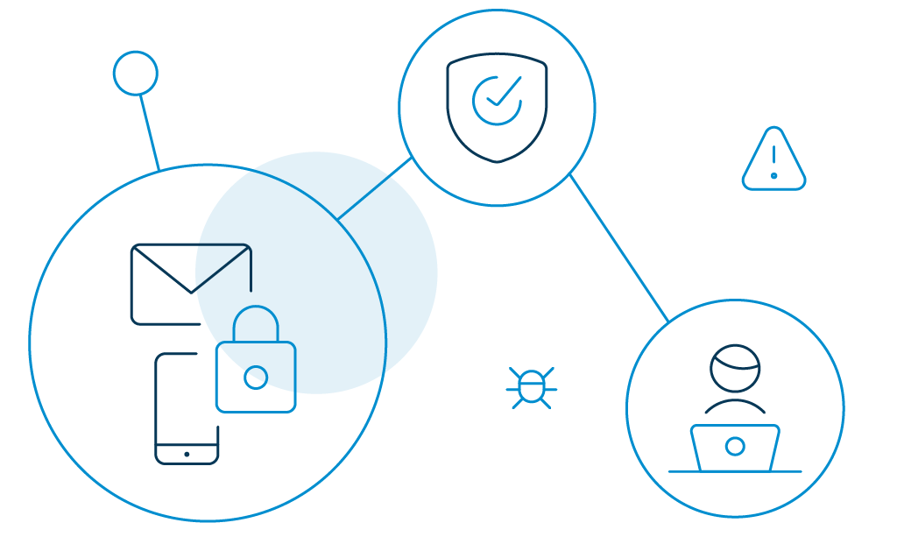

Phishing attacks are on the rise, and they are unfortunately more sophisticated than ever.

In the past, identity theft could be seen as a common subject in blockbusters or police drama TV series. Today, however, phishing is a reality that could affect anyone.

So why are these types of attacks on the rise? After all, phishing is not exactly a new concept.

The reason is they are incredibly profitable for the attackers.

**The average data breach costs organizations [\$3.92 million](https://www.ibm.com/security/data-breach).**

A Phishing attack can be a death blow for businesses that don't take the necessary precautions. Not only is the top-line affected, but the brand's image and trust can be obliterated if news of a data breach reaches the public.

- The healthcare industry saw the most breaches accounting for [USD 7.13 million in 2020](https://www.ibm.com/security/data-breach).
- Incidents involving payment and invoice [fraud increased by 112%](https://info.abnormalsecurity.com/Q2-2020-Quarterly-BEC-Report.html) between Q1 2020 and Q2 2020.
- [96% of phishing attacks](https://enterprise.verizon.com/en-gb/resources/reports/dbir/) arrive by email, 3% are carried out through malicious websites, and just 1% via phone.
- 86% of breaches were financially motivated in 2020.
- 43% of breaches were attacks on web applications in 2020. That's more than double the results from 2019.

## What is Phishing

Let's jump back to the beginning and answer the obvious question: What is a Phishing attack?

A Phishing attack or scam is when an attacker sends an email pretending to be someone (for example, the CEO of an organization) or something he's not (for example, poses as Google). The goal is to extract sensitive information out of the target.

Essentially, the [attacker attempts to create fear](https://www.loginradius.com/blog/start-with-identity/2019/01/how-do-i-know-if-my-email-has-been-leaked-in-a-data-breach/), curiosity, or a sense of urgency. When the target is prompted to open an attachment or fill in their sensitive information (i.e., username, password, or credit card number), they are likely to give in.

A few examples of phishing attacks include:

- Emails that appear to come from a legitimate source, like Amazon customer support or your bank.
- Phone calls that force victims to act immediately.
- Emails that include links to fake websites and the victim [enter their credentials](https://www.loginradius.com/blog/start-with-identity/2019/09/prevent-credential-stuffing-attacks/).
- Emails appear to come from the victim's organization's human resources department and ask to update your details or install a new app on their system.
- Online advertisements that force the victim to click on a valid-looking link that redirects to a malicious website.

## 7 Ways to Detect a Phishing Email - Here's How

### 1. The email is sent from a public domain.

No legitimate organization will send you an email from an address ending with '@gmail.com.' No! Not even Google.

Almost all organizations have their own email domain and company accounts from where they send out official messages.

Therefore, before opening an email, ensure that the domain name (what follows after @) matches the sender.

There is a catch, though. Hackers may try to mimic a real email. For example, if an address looks like 'paypal@notice-access-273.com', that is a red flag.

A genuine email from PayPal will have PayPal in the domain name, i.e., after the @ symbol.

### 2. The email requests your sensitive information.

If you receive an anonymous email asking for sensitive information, chances are it's a scam. No companies will send you an email requesting passwords, credit card data, tax numbers, nor will they send you a login link.

### 3. The email has terrible grammar.

Bad grammar is one of the easiest ways to recognize a phishing email. Because the legitimate ones are always well-written with no lousy syntax, they are often written by professional writers who exhaustively check for spelling before sending them out.

So, the next time you receive an email with strange phrases and poor language in the body of the message, it is actually a phish.

### 4. The email has a suspicious attachment.

You should be alarmed if you receive an email containing an attachment from a company that you do not recognize or that you weren't expecting. A malicious URL or trojan may be included in the attachment.

It's good practice always to scan it using antivirus software first, even if you believe the attachment is real.

### 5. The message has made you panic.

Phishing emails are popular to incite fear in the recipient. The email can say that your account may have been compromised, and entering your login details is the only way to verify it. Alternatively, the email will state that your account will be closed if you do not respond immediately.

In any case, contact the company through other methods before committing any action.

### 6. The email says you have won a lottery.

So, you received an email about winning a lottery, gift cards, or some new gadgets, but you do not remember buying tickets for it—that's definitely a scam.

And when you open the message and click on a link, you will be redirected to a malicious website.

### 7. The email is from a government agency.

The government will never contact you directly. And most definitely, they won't engage in email-based harassment. Scammers send messages to victims claiming to be the IRS or the FBI demanding their personal information.

Most of the IRS sends direct official letters to home addresses and do not send you an email or call you until you receive an official letter.

Moving on.

Phishing attacks may have a variety of targets depending on the attacker. They could be as generic as email phishing, looking to scam anyone who has a Facebook account, or could be extreme as targeting literally one victim.

[Verizon statistics](https://enterprise.verizon.com/resources/reports/2019-data-breach-investigations-report.pdf) show that 94% of malware attacks begin with phishing via email.

We have hashed out the different types of phishing attacks.

## What Are the Common Types of Phishing Attacks and How To Prevent Them

- Spear Phishing

[Spear phishing targets](https://en.wikipedia.org/wiki/Phishing#Spear_phishing) a particular group or category of people, such as the organization's system administrators. Hackers customize their attack by sending emails with the target's name, work phone number, position, company, and other information to deceive the recipient and trick them into believing that the sender is genuine.

They ask the victim to click on a malicious URL or email attachment and get hold of their sensitive data.

Organizations should conduct employee security awareness training to defend against this type of scam. They should discourage employees from sharing personal or organizational details on social media. Companies should also invest in solutions that analyze identified malicious links/email attachments for inbound emails.

- Whaling

Whaling is an even more focused form of phishing since it goes after the whales, the BIG fish within the [industry like the CEO, CFO or CTO](https://www.loginradius.com/blog/start-with-identity/2020/09/consumer-identity-management-cmo-ciso-cio/).

For example, c-suite executives might get an email stating that their company is being sued, and for more information, they need to click on the link. The link redirects them to a page where they enter all of their company's sensitive details like Social Security numbers, tax ID #, and bank account #s.

Whaling attacks succeed because executives often do not engage with their staff in security awareness training. Organizations should mandate that all company employees, including executives, engage in safety awareness training on an ongoing basis to address the risks of CEO fraud and W-2 phishing.

Organizations should also introduce multi-factor authentication (MFA) into their financial authorization processes so that no payment is authorized via email alone.

- Smishing and vishing

Both smishing and vishing involve the use of phones instead of emails. Smishing involves sending text messages to the victim with messages to lure them in to share sensitive information. While hackers communicate via phone in vishing.

A typical vishing scam involves a hacker posing as a fraud investigator telling the victim that their account has been compromised. The hacker would then ask the victim to provide their bank details to transfer money into a 'safer' account, the hacker's account.

Stop answering calls from unknown phone numbers to defend against vishing attacks. Never give out private details over the phone and use a caller ID app.

You can protect against smishing attacks by carefully observing [unknown phone numbers](https://www.loginradius.com/blog/start-with-identity/2020/12/how-to-stop-phone-hacking/) and if you have any doubt, reach out directly to the company that's mentioned in the message.

- Email phishing

It is no secret that the majority of phishing attacks [are sent by email](https://www.loginradius.com/blog/start-with-identity/2020/12/what-to-do-when-email-hacked/). Cybercriminals register fake domains that mimic a real organization and send out thousands of generic requests.

They may use the name of the company in the email address like paypal@domainregistrar.com in the anticipation that the name of the sender would simply appear in the inbox of the recipient as 'PayPal'.

There are many ways to spot a phishing email, but in general, always think before you click an email. Never click on suspicious links, download attachments, or share any sensitive information via email.

- Search engine phishing

Also known as SEO poisoning or SEO trojans, search engine phishing is the type of phishing where hackers create a fake webpage by targeting specific keywords. When the victim lands on the webpage, they are redirected to the hacker's website.

These websites could be anything. For example, if you are looking for a job, you may come across fake offers with non-existing companies. The application will require you to provide your personal data like bank details or insurance accounts.

Remember, no company asks for personal details unless you are hired. Therefore, it is high time you start being cautious.

Here are a few other guidelines to keep yourself safe from phishing attacks.

- New phishing attack methods are developed all the time. Therefore, keep yourself informed about the latest ones.
- Do not click on a link in an email or instant message unless you are sure that it is genuine.
- Download an anti-phishing toolbar that will alert you every time you are about to enter a known phishing site.
- Keep your browser up-to-date and check your online accounts regularly for traces of phishing attempts.
- Use high-quality firewalls as a shield between you, your computer, and outside intruders to reduce the odds of phishing attempts.
- Be cautious of pop-up windows as they often redirect to malicious websites. Do not click on the "cancel" button, as those buttons often lead to phishing sites. Click the tiny 'x' in the upper corner of the browser instead.
- Get into the habit of regularly [changing your passwords](https://www.loginradius.com/blog/start-with-identity/2021/01/how-to-choose-a-secure-password/) to lock out potential attackers.
- Do not share your personal information anywhere over the Internet.
- Train your employees to adopt the best anti-phishing practices.

## Conclusion

Using the tips mentioned above, businesses will be able to identify some of the most common kinds of phishing attacks. But, that doesn't mean that you can spot every phish. It's a harsh reality that phishing is constantly evolving to adopt new techniques.

With that in mind, you need to be on top of the game every single day. Keep on conducting [security awareness training](https://www.loginradius.com/blog/start-with-identity/2019/10/cybersecurity-best-practices-for-enterprises/) so that your employees and executives never fall prey.

