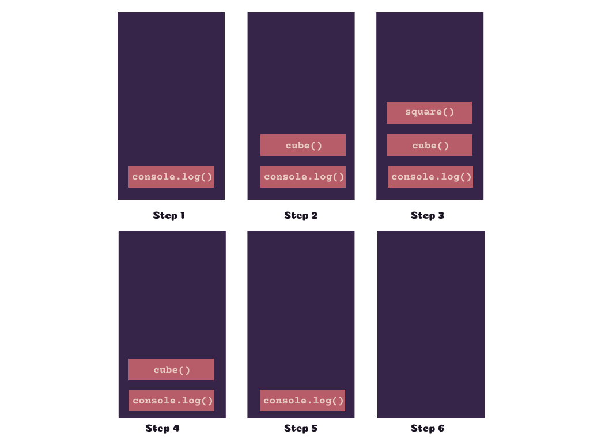
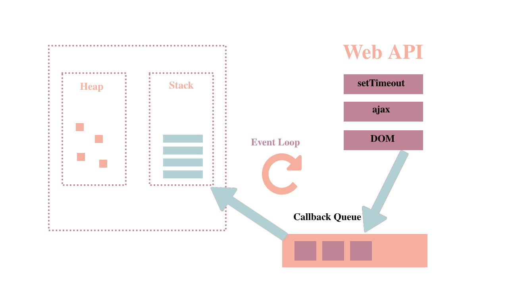

We often hear that JavaScript is a single-threaded programming language, which means it executes all of the instructions line by line in a synchronous manner. Thus since everything works on the main thread, there seems to be no possibility of executing parallel processes in JavaScript.

But now let's assume that we have a function which is taking some time to execute, for example in the below function which is having a loop over 10k times, the `console.log()` would be executed once the loop is over and in the meantime, our UI interaction with the browser would be interrupted.

```JavaScript
function someTimeTakingFunc() {
  for(var i = 0; i < 10000; i++) {

  }
  console.log("Loop has been executed")
}
```

The above scenario seems to be impractical, but there might be cases where any function can take an indeterminate amount of time and our main thread would be blocked, for example calling an API for fetching data from the server-side. And this is the practical use case we are dealing with in development every day. So how JavaScript handles this and where does the event loop come into the picture? We will surely get to know this, but before moving further, let's understand the basic memory architecture in JavaScript.

### Memory Organization of JavaScript: 

The Javascript Engine consists of two main components:
 -  **Memory Heap** — this is where the memory allocation happens, all of our object variables are assigned here in a random manner.
 -  **Call Stack** — this is where your function calls are stored.

 ### Understanding the Call Stack

Call stack is a LIFO (last in first out) data structure. All of the function calls are pushed into this call stack and are said to be a frame. In short function, a stack is nothing but the simple stack data structure which keeps track of the function currently being executed.

Let's understand the above concept with the example of the following code snippet:

 ```JavaScript

  function square(b) {
    return b * b ; 
  }

  function cube(x) {
    return x * square(x)
  }

  console.log(cube(8));

 ```

The above snippet is an example of defining a `cube`  function, which is calling a `square` function, to find the cube of a number passed in the argument. But how does this work in call stack? Let's understand step by step: 

1. When we call the `console.log()` line, this `code/function` is pushed into the call stack. 
 2. Now the above `console.log()` function is called the `cube` function, hence this function is pushed into the stack. 
 3. After this the `cube` function is calling the `square` function, and now this would be pushed into the stack. 
 4. Now once the `square` function is executed, and the result is returned, then the `square` function is popped out of the stack. 
 5. Since at this step, we have got the `square` function result, so `cube` function would be executed and popped out of the call stack. 
 6. At last, the `console.log()` would be executed and this function would be popped out of the stack and the stack would now be empty.




Now since we have understood that call stacks are possible to execute the function in a step by step manner, there seems to be no possibility of keeping something into parallel. But there is something called **"WEB APIs"** in the browser environment, which is some additional capabilities provided by browsers in addition to JavaScript Engine.

### Javascript Web APIs

These are the additional functionality, that helps us perform some additional tasks which cannot be run using the main thread. However, since our JavaScript runtime is single-threaded, it can export some tasks to the WEB APIs which helps us to respond to multiple threads. Example of some web APIs are:

- DOM 
- Ajax (Network requests)
- setTimeout()

For instance, `setTimeout()` is called, the browser delegates the task to a different thread to calculate the time interval specified in the argument of the `setTimeout()` method, and once done this tread would then call the desired function in callback stack.

Since JavaScript is single-threaded, the browser has the capability of delegating the task in multiple threads. But how does the event loop help in these executions? But now we are good to go ahead with Event Loop. 

 
### Event Loop && Event Queue

Since we know that Web APIs delegate some of the tasks to different threads, on completion of these tasks, how the main or desired functions are sent to the call stack. 

Event Queue is a special queue, which keeps track of all the functions queues, which are needed to be pushed into the call stack.
The event queue is responsible for sending new functions to the track for processing. The queue data structure is required to maintain the correct sequence in which all operations should be sent for execution.

Let's take an example, in the following example, we are using a `setTimeout` function, which will log the "executed" string after 2000 milliseconds. 

```JavaScript
  
  setTimeout(function(){
    console.log("Executed";)
  }, 2000);
```

Now when a setTimeout operation is processed in the call stack. On its execution, it calls a web API which fires a timer for 2000 milliseconds. After 2000 milliseconds has been elapsed, the web API, place the callback function of `setTimeout` in the event queue. 

Here need to mention that, just placing our function does not necessarily imply that the function will get executed. This function has to be pushed into the call stack for execution and here the event loop comes into the picture. The event loop waits for the function stack to be empty, once the call stack is empty this will push the first function from the event queue to the call stack, and in this way, the desired function will be called.




Thus event loop works in a cyclic manner, where it continually checks whether or not the call stack is empty. If it is empty, new functions are added from the event queue. If it is not, then the current function call is processed.

