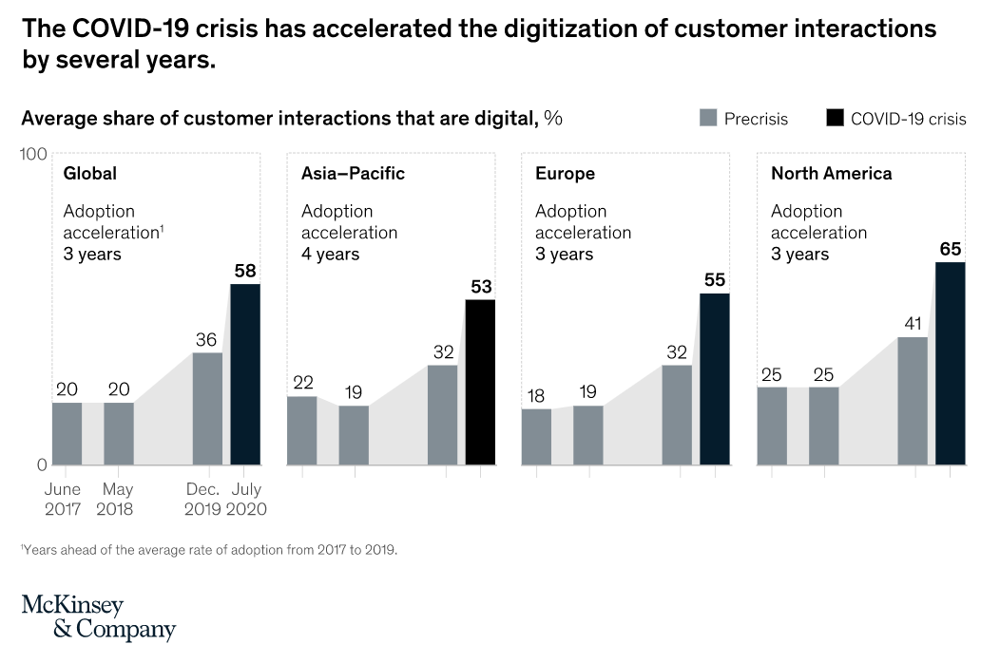
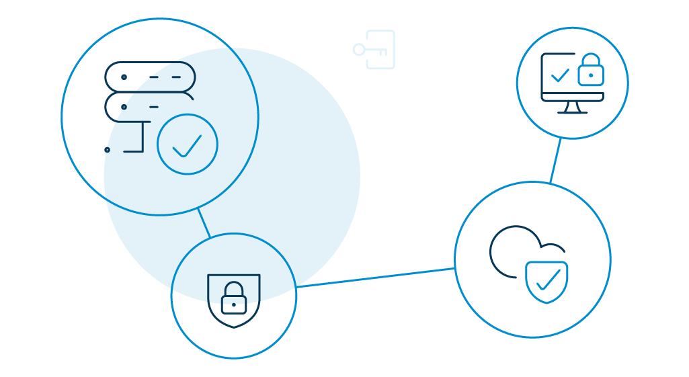

Fundamentally, digital transformation is the accumulation of modern tools and processes to solve market challenges and provides possibilities for upbeat consumer intimacy.

When it comes to businesses, every era brings its own _buzzword_. 

For example, for the '90s, it was the internet. Towards the beginning of this century, it was social media. And now, it's digital transformation. 

Companies need to gear up and leverage technologies to satisfy their employees and consumers today. 

We can further gauge the importance of organizations having to invest in new-age transformation, when former Executive Chairman of Cisco System, [John Chambers](https://www.linkedin.com/in/johnchambersjc?challengeId=AQGj82b-dklBrwAAAXbhY6du4U1xpb-eEQscCsXGTjVf1-tgV8O429bPJ6qulSCN0WBxVHl9o5Yd8iLIunNKF65tAy_kvO9Jzg&submissionId=e49444cc-aa38-5816-7489-798dda357e18) stated, "At least 40% of all businesses will die by 2025, if they don't figure out how to change their entire company to accommodate new technologies." 

But despite such affirmatives, digital transformation has a long way to go. In this blog, we have summarized its importance for organizations, what has changed during the pandemic, and what to look forward to in 2021. 

Let's start with the definition.

## What is Digital Transformation

Digital transformation is the process of leveraging digital technology to develop new business processes and consumer experiences to meet the changing market dynamics or to alter the existing ones. 

Beyond that, it is also an aggregation of cultural change that expects companies to experiment often and not get demotivated when new practices and not accepted in public. 

However, note that every company reimagines transformation differently. It isn't easy to define a concept that applies to all. 

You can start by outlining your organization's problem statement, opportunities, and goals. In most cases, that revolves around:

*   Utilizing digital technologies
*   Reducing friction
*   Increasing productivity
*   Improving consumer experience 
*   Elevating the scope of profitability

Digital transformation is interconnected. One innovation leads to another. So when process improvements happen, it leads to better product and service gains. When consumers grow accustomed to those changes, they demand more, and the cycle continues.

All-in-all, you need to understand what digital transformation really means for your organization and what you should do to articulate it.

## Why is Digital Transformation Crucial for Enterprises

[Organizations may idealize](https://www.loginradius.com/blog/start-with-identity/2018/11/enterprise-needs-digital-business-transformation-strategy/) digital transformation for many reasons. But the most likely explanation has to be _survival_. 

Think of it this way. The more simplicity you bring for consumers, the more likely are your chances of survival. 

The [Annual Manufacturing Report 2020](https://info.themanufacturer.com/amr-2020) showcases that senior manufacturing executives are clearly prioritizing digital transformation. The finding shows: 

*   87% of companies prefer digital technologies for future prosperity.
*   89% of companies acknowledge how digital technologies improve their inbound and outbound supply chain relationships.
*   91% of companies agree that digitalization has made their employees more productive.
*   87% of companies find that digital technology has further accelerated innovation. 
*   66% of companies are already considering cloud computing, and 63% are inclining towards automation. 
*   Almost one in two businesses are implementing some form of cybersecurity policies. 

The world of business is changing. Organizations are willing to experiment, adopt, and adapt to new technologies. 

So, where do you stand? Are you still going traditional? 

Are you developers migrating to the cloud environment? Are you already making technological decisions? Or are you still waiting for a wake-up call? 

Wherever you are... START! 

## Has Digital Transformation Changed With the COVID-19 Pandemic

The answer is _yes_. The COVID-19 pandemic has pushed businesses over the "technology" edge forever. 

According to [McKinsey Global Survey](https://www.mckinsey.com/business-functions/strategy-and-corporate-finance/our-insights/how-covid-19-has-pushed-companies-over-the-technology-tipping-point-and-transformed-business-forever#), the virus has accelerated the digitization of consumer and supply-chain interactions by three to four years. Also, the share of companies digitally-enabling product manufacture has accelerated by seven years.

The survey also shows that the rates of digital adoption are three times likelier now than before the crisis.

Source: Mckinsey

Needless-to-say, the global pandemic has exposed the clear digital divide between companies across the globe. 

On one side, some businesses have invested in digital enablement as part of their [continuity plan](https://www.loginradius.com/blog/start-with-identity/2020/03/loginradius-business-continuity-covid-19-outbreak/) (and fared with almost zero setbacks). On the other side, there are those companies that are struggling to achieve the bare minimum. 

## What Will the Structure for Digital Transformation Look Like in 2021

Looking ahead to 2021, digital transformation is set to [become a crucial topic of discussion](https://www.loginradius.com/blog/fuel/2018/08/4-things-consider-starting-digital-transformation/) in all boardrooms. 

Speaking of the positives, [63% of the McKinsey survey](https://www.mckinsey.com/~/media/McKinsey/Industries/Retail/Our%20Insights/Perspectives%20on%20retail%20and%20consumer%20goods%20Number%208/Perspectives-on-Retail-and-Consumer-Goods_Issue-8.pdf) respondents were affirmative that countries will pick up pace after the setback of 2020 and do better six months from now. 

Meanwhile, the global outlook has also bounced back. 

As businesses race to adjust to the new normal, we anticipate the following parameters to play out exceptionally on the global canvas. 

### Digital nationalism will be the buzzword.

Lately, new, emerging technologies are being responsible for a huge part of any country's economic value. This clearly means that businesses (no matter the size) are investing in big tech solutions to retain their edge in their respective industries. 

However, in these trying times, it is also crucial that countries invest in digital products and services that aid in national security and the economy at large. We should anticipate strengthened regulatory structures and increased scrutiny on activities related to merger and acquisition (M&A).

### Futuristic workspaces will rule.

The COVID-19 pandemic seems to have hit the reset button on how people work. We are witnessing a changing approach of people towards jobs, mobility, and versatile work models. 

Nonetheless, we expect to see new work delivery models, along with a major transformation in employment constructs. Most of these latest models will be driven by digital realization platforms.

### Tech debts will be channelized.

Technology debts is a common liability witnessed in large enterprises. This happens because businesses go through multiple cycles of tech acquisitions and implementations over time. 

The ongoing crisis may provide leaders with an opportunity to carefully assess their tech environment and recognize opportunities where such debts can be withdrawn. So, companies can leverage the cash flow for future digital investments when debts are taken care of. 

### Digital skills will take the lead.

Technologies will drive digital transformation, and they will also power a competitive edge for businesses. Only those with a triad of skills, viz. digital, professional, domain, and functional skills, will rule the future. 

For companies, this is an ideal time to focus on a digital talent pool and use the opportunity to create a universal foundation of digital skills.

### Digital labour will witness a paradigm shift.

The world was already onboarding digital labor and bots. But when COVID-19 happened, this shift towards automation further intensified. 

Now, companies will want to exploit digital channels that can stay unaffected in the event of a crisis and minimize dependency on workers.

Moving on.

Digital transformation will be a powerful lever in the response of companies to the current crisis. Therefore, it is expected of companies to formulate plans that will give them the ability to adapt their business models in accordance with the rapidly evolving business environment. 

*   **Understand your channel**: Understand, in particular, which intermediary sites impact purchasing and how consumers toggle between channels.
*   **Set targets**: This includes monthly targets for direct sales, as well as indirect sales.
*   **Identify target prospects and prioritize them**: Targeting the right demographics or personas is important. And digital media makes micro-targeting possible for your business.
*   **Leverage the use of channels**: Articulate the advantages of using multiple digital platforms. 
*   **Highlight the differences, build suggestions**: This involves the differences between online platforms and other channels. 
*   **Offer integration between channels**: Seamlessly integrate different channels throughout the consumer journey.
*   **Review competitors**: Find out who your competitors are targeting and where do you lag.
*   **Develop channel partners**: Identify the leading players and influencers in your business ecosystem, and form strategic alliances.

## What Drives Digital Transformation

As we speak of digital transformation or digital conversion, we are often focused on technology. With technology evolving so rapidly, it is tempting to believe it's the main force that has been driving digital transformation all along the way.

But is it really so?

Turns out, _no_, it isn't. 

According to [PwC's CFO Pulse survey](https://www.pwc.com/us/en/library/digital-iq.html), nearly 50% of the organizations list consumer engagement and loyalty as their leading influencers when it comes to adopting digital transformation strategies in their company. 

This means companies that are undergoing digital transformation are also creating highly engaged consumers. According to [Rosetta Consulting Study](https://www.prnewswire.com/news-releases/rosetta-consulting-study-shows-that-customer-engagement-increases-market-share-and-drives-revenue-growth-267184761.html), these consumers are:

*   Six times more likely to experiment with new products and services launched by their favorite brand.
*   Four times more likely to refer a brand to their friends and connections. 
*   Two times more likely to buy from their favorite brand, even when a competitor has a better product. 

There is one thing clear—_consumers _are running the show today. 

Businesses need to understand who these new kinds of digital customers are in order to offer better experiences and win big.

You have to rethink new ways of interacting with your consumers. This means:

*   **For B2B sales teams**: Replace cold calling with social selling. You need to be always active where your consumers are. So, where else can you find them other than social media? Instead of waiting for them to contact you, take the first step, and reach out to them. Lure them to build a relationship with your brand.
*   **For marketing teams**: Cut off your expenses on offline marketing activities. No one uses billboards and direct mails anymore. Your consumers will benefit from highly personalized, data-driven marketing strategies instead.
*   **For customer service teams**: Your consumer's phone is not the only medium anymore. From social media, forums, and communities to review sites, there is a wide range of channels to seek support.

### Get Started with Digital Transformation

*   **Personalize your consumer experience.**

Today's consumers want businesses to regard them as a distinctive individual and consider their personal preferences and purchasing background. 

[According to Accenture](https://www.accenture.com/us-en/about/accenture-interactive-index), 75% of consumers admit that they are more likely to purchase from an organization that:

*   Identifies them by their name.
*   Knows their purchase history.
*   Recommends products based on their purchase history.

Consumers today do mind companies using their data to make their lives easier. 

Moreso, as businesses, you should invest in a CRM system. They help you analyze data based on consumer's previous interactions. 

For example, you can get a clear understanding of your consumers by analyzing their product requests. This information can then be used to produce highly tailored messages, resulting in a more personalized experience.

*   **Offer instant gratification.**

Speed is more important than ever. Consumers expect responses from companies within seconds. They also anticipate the same response time on weekends as on weekdays—on-demand, 24 hours a day, 7 days per week.

*   **Define your digital vision.**

Identify why you are shifting and what you plan to accomplish. This is the basic component that will lead the rest of your journey.

*   **Map your digital journey.**

You must build a vision of how digitalization applies to your processes and where it can make a difference in achieving better consumer experiences. 

*   **Understand your digital maturity.**

Perform a digital maturity assessment to find how much you have fared in leveraging digital transformation and the areas where you require improvement. 

## Digital Transformation Trends to Watch Out in 2021

2020 witnessed a massive undertaking of digital transformation across industries. Simultaneously, digital transformation fatigue became a regular appearance. 

Therefore, it is high time that you introspect your team and understand if they are getting tired or less engaged.

2021 will also see the best of digital transformation in transit. Many have already stated the journey, and the rest is expected to follow soon. 

The uncertain way of global pandemic has introduced new patterns. Businesses and IT leaders should be aware of what's in the making. The following key digital transformation trends will take over the upcoming new normal in 2021.  

### Explosion of Customer Data Platforms (CDP).

Data is growing exponentially, and it definitely won't stop anytime shortly. Data warehouse, analytics platforms, and visualization software will not lose significance. Still, at the same time, the world is about to witness a rapid adoption of customer data platforms (CDP) in 2021. 

So, what are these CDPs? A CDP is a packaged software that collects and organizes data from all available sources, tags it, and makes it accessible for anybody who wants to use it. 

Now that business processes have become much more decentralized, courtesy of the new work-from-home models and the ongoing growth of data collection, CDPs will become increasingly important in 2021. 

Companies such as Adobe, SAP, Oracle, and Microsoft are already invested heavily to bring new CDPs to the market.

### Automation will increase financial proficiency.

As the world is trying to recover from the pandemic, financial institutions are particularly concerned about their shrinking revenue and loan losses. This has encouraged them to lean towards automation and robotics. 

While still in its earliest stages, Robotic Process Automation (RPA) can increase productivity by providing a cost-effective substitute to Human Resources. 

Other recorded advantages of RPA include improved consumer experiences, flexibility, upgraded precision, and proficiency in work. 

### Utilization of AI.

When the pandemic hit, AI and data were suddenly liberalized and accelerated to a massive extent. It happened almost overnight that governments and organizations found themselves working together to establish a quicker way to avoid the spread of the virus.

Everyone was turning their heads to AI, machine learning, and data. So, what began as an emergency in 2020 will continue to scale in 2021 and is likely to spread across a wide variety of opportunities. AI will be addressing global and business issues quicker, better, and on a broader scale.

While many may still consider AI to be more of a future trend, it is already here and driving our everyday lives. For example, when you receive recommendations on Netflix or while shopping on Amazon, that's the work of an AI.  

### Quantum computing will go mainstream.

2020 witnessed a number of achievements from various pioneers in the quantum industry, including IBM, Amazon, [Honeywell](https://www.cnet.com/news/honeywell-fires-up-the-h1-its-second-generation-quantum-computer/), and Google.

These companies have been favoring quantum advantage or supremacy by claiming that a quantum computer can calculate hundreds or thousands of times faster than a classical computer. Also, the technology in question is efficient enough to complete calculations that classical supercomputers can not do at all. 

Quantum computing was also at the forefront of digital transformation during the pandemic endeavors to stop the spread of infection, as well as the development of therapeutics and future vaccines. 

2021 will be no different. Quantum computing will continue to rise and bring more efficiencies to the table

### Work From Home will outlast the pandemic.

For quite a while, employees were pushing for greater job flexibility, and organizations opting to allow remote work were only a handful. In 2020, when the pandemic caught most companies off-guard, telecommuting seemed the only rational solution.

Now, even when things are gradually getting back to normal, organizations are still allowing people to work from home—as a possible shield to protect from future outbreaks. Large tech organizations like [Google](https://www.indiatvnews.com/business/news-google-extends-work-from-home-policy-till-september-2021-671463) and Facebook have already extended their remote arrangements for parts of 2021. 

Now that companies know how remote setups work for them, also how they are more productive despite physical distance, work from home models may continue to exist for a few more years, and maybe beyond. 

### Cybersecurity will gain momentum. 

Between January and April 2020 alone, there was a [630% rise in cyberattacks](https://www.mcafee.com/enterprise/en-us/assets/reports/rp-cloud-adoption-and-risk-report-work-from-home-edition.pdf) on cloud accounts and a 238% rise in banks. Cybersecurity was the talk of the town throughout the pandemic. 

Because there were fewer employees onsite on the same network, it became crucial for companies to upgrade their cybersecurity strategies and extend them beyond their corporate network. 

Despite the attacks, 2021 may witness an accelerated workload migration to the cloud. A [Gartner analysis](https://www.gartner.com/smarterwithgartner/the-cios-guide-to-distributed-cloud/) finds "distributed cloud" may take over along with some profound security implications.  

## The Role of Culture in Digital Transformation 

Culture in digital transformation has no mysterious or unseen presence. Digital is about embedding culture into business operations to succeed, and not just update technology, redesign products, and improve client relationships. 

So, if you fail to align your business initiatives with employee values and expectations, you end up generating additional risks to your company's culture. The consequences include slow adoption of digital technologies, lost productivity, loss of market competitiveness, and an ultimate decrease in ROI. 

And that's not how digital transformation functions. You need a more systematic and collaborative attitude towards cultural change instead.  

For organizations trying to shape their digital aspirations, what's lacking is transparent and realistic guidance on shaping their culture for the road ahead. 

Our best tip for any organization will be to invest in a sustained effort that allows teams to cultivate a more profound passion and empathy for their business.

## How Do You Measure ROI on Digital Transformation

The ability to define and calculate the return on investment (ROI) of digital transformation can be very difficult for transformation leaders. 

After all, it is not possible to measure consumer experiences. Instead, you need to assess your business as a whole and consider the changes in your processes and workflows.

How do you start? Simple. By creating a strong investment case. The following steps below will help you build a practical ROI model for your business. 

**Step 1: Narrow down your objectives for digital transformation**: Do you want to digitize your data? Integrate touchpoints? Increase productivity in operations? Or repeat purchases? 

It can be one or a combination of many objectives. Jot down your roadmap to understand what KPIs you should measure. 

**Step 2: Define your cost centers**: List out all your business areas where you have incorporated digital transformation. 

For example, it will include not just your IT department (which is an obvious choice for your technology upgrade). You should also consider the additional cost of training your employees to help them understand your new web portal.

**Step 3: Allocate a figure to all consumer metrics**: Make sure to include all potential impacts on sales from improvements in consumer experience like: 

*   Consumer churn
*   Repeat purchases
*   Referrals
*   Satisfaction scores
*   Operational costs (training, recruitment)
*   Employee incentive schemes

**Step 4: Set realistic timelines and milestones**: When will you calculate the progress of each aspect of your digital transformation? The timeline is essential.

For example, if you are launching a new self-serve application, your inbound call levels are bound to decrease in the first year. But your KPIs will gradually pick up as consumers enjoy the benefits of your product. Therefore, do not set your aspirations too high in the beginning. 

## Meet the Industry Experts

We have caught a few digital transformation leaders in action as they offer valuable perspective and guidance. 

*   **[Deepak Gupta](https://www.linkedin.com/in/dpgupta), CTO at LoginRadius**: Digital transformation does not come easy. Leaders must become transformers of their enterprise culture and strike the right balance between short-term improvement and long-term value.
*   **[Jim Swanson](https://www.linkedin.com/in/jimdswanson/), CIO at Johnson & Johnson**: We talk about automating operations, people, and new business models. You could have all those things – but if leadership and culture aren't at heart, it fails.
*   **[Dion Hinchcliffe](https://www.linkedin.com/in/dhinchcliffe), VP at Constellation Research**: The top IT executives today must match the pace of change, fall behind, or lead the pack. That's the existential issue at stake, where bold action must be actively supported by out-of-the-box experimentation and pathfinding. 
*   **[Bryson Koehler](https://www.linkedin.com/in/brysonkoehler), CTO at Equifax**: If you look at the vast majority of startups, they're not starting with giant, shrink-wrapped software packages as their company's base. If you're trying to create innovation inside a large enterprise, you shouldn't start with it either. You're not here to run the mainframe anymore. 
*   **[Sven Gerjets](https://www.linkedin.com/in/svengerjets), CTO at Mattel**: If you don't have an organization that is supportive and entirely onboard with the transformation efforts, it's impossible to succeed. You need to have leaders that know what "good" looks like. 

## Conclusion

Digital transformation is an amalgamation of strategy, roadmap, goals, stakeholders, and all the parameters needed to succeed. 

Right now, businesses are rapidly including the creative use of data, be it via analytics, IoT, or machine learning etc. for their transformation activities. Clearly, in many ways, digital-led transitions are evolving and are here to stay. 

Only the adapters will survive!

