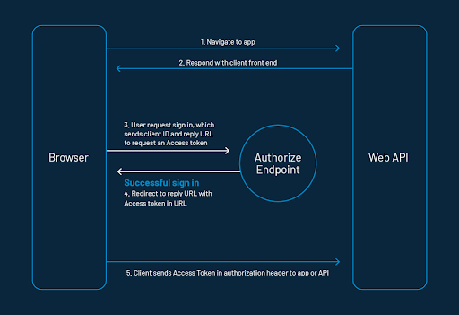

OAuth stands for Open Authorization. It's a process through which an application or website can access private data from another website. It provides applications the ability to "secure designated access." For example, you can tell Google that it's OK for abc.com to access your Google account or contact without having to give abc.com your Google password.

OAuth never shares password data but instead uses authorization tokens to prove an identity between consumers and service providers. OAuth is an authentication protocol that allows you to approve one application interacting with another on your behalf without giving away your password.

To understand this, let's take the example of Facebook. When an app on Facebook asks you to share your profile and pictures, Facebook acts as a service provider: it has your data and image, and that app is a consumer. If you want to do something with your picture with the help of this app, you need to provide permission to this app to access your images, which the OAuth manages in the background.

## How Does the OAuth2.0 Work

The following explains the working of the above sequence diagram of Oauth 2.0 implementation: 

1. Let's assume the client requests authorization to access protected resources owned by the resource owner by redirecting the client to the authorization server.
2. The resource access request is authenticated and authorized by the resource owner from the web application, and the authorization grant is returned to the client by an authorized endpoint.
3. There are four types of Grant Protocol defined by OAuth 2.0: **Authorization Code**, **Client Credentials**, **Device Code**, and **Refresh Token**.
4. The client requests the access token from the authorization server by presenting the authorization grant returned from the authorized endpoint and authentication of its own identity to the token endpoint. A token endpoint is a URL such as https://your_domain/oauth2/token.
5. The access token will be issued to the client for valid authentication and authorization grant by the authorization server or authentication provider.
6. By presenting the access token for authentication, the client can request the protected resources from the resource server.
7. The requested resources are returned to the application (client) with the valid access token from the resource server.

**Also Read: [Guide to Authorization Code Flow for OAuth 2.0 ](https://www.loginradius.com/blog/async/authorization-code-flow-oauth/)**

## Why You Should be Using OAuth

OAuth provides applications the ability to secure designated access. In the traditional method, before OAuth, sites ask for the username and password combination for login and use the same credentials to access your data.

With OAuth flow, instead of sending the username and password to the server with each request, the consumer sends an API key ID and secret. In this scenario, the consumer communicates to their identity provider for access. The identity provider generates an encrypted, signed token that grants the application access by authenticating the consumer. This process works on trust between the Identity Provider and the application. It will create a better interface for web applications.

## Working with OAuth Token & Scope

The authorization server authenticates the client and validates the authorization grant, and if valid, issues a token known as an **access token. **It must be kept confidential and in storage. This access token should only be seen by the application, authorization, and resource server. The application makes sure that the storage of the access token can not be readable to other applications on the same device.

The [OAuth 2.0 authorization protocol](https://www.loginradius.com/blog/start-with-identity/oauth2.0-guide/) defines the following methods to receive the Access Token. These Flows are called grant types. So you can decide the grant types as per the use case or it is based mainly on the type of your application.

The following are the five types of grants described to perform authorizations tasks. Those are

* Authorization Code Grant
* Implicit Grant
* Resource Owner Credentials Grant
* Client Credentials Grant
* Refresh Token Grant \

**The scope** specifies the level of access that the application is requesting from the client. An application can request one or more scopes. This information is then presented to the consumer on the consent screen. The access token issued to the application will be limited to the scopes granted. **Consent** tells your consumers who is requesting access to their data and what kind of data you're asking to access.

## Blending OAuth with LoginRadius

LoginRadius Identity Platform supports standard [OAuth 2.0 specs](https://tools.ietf.org/html/rfc6749) to integrate your OAuth client with LoginRadius. Thus, you can allow your application's customers to log in to an OAuth-enabled application without creating an account. This[ document](https://www.loginradius.com/docs/single-sign-on/tutorial/federated-sso/oauth-2-0/oauth-2-0-overview/#oauthguide0) goes over the complete process of getting the SSO feature implemented with OAuth 2.0.

## Conclusion

This article talked about OAuth 2.0 as an authorization framework for delegated access to web APIs. This feature grants the resource access to the consumer without exposing their password to their application. However, before implementing any functionality on your website, analyze and consider the pros and cons from every possible angle.

Cheers!

