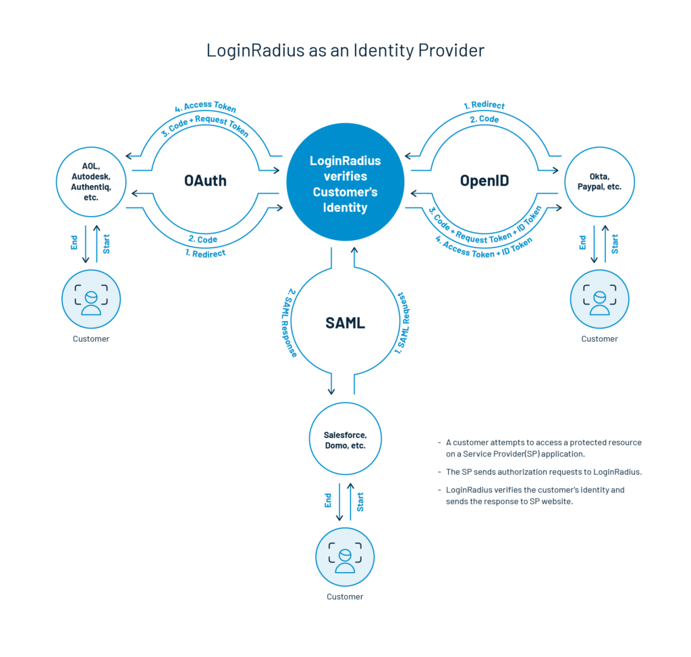
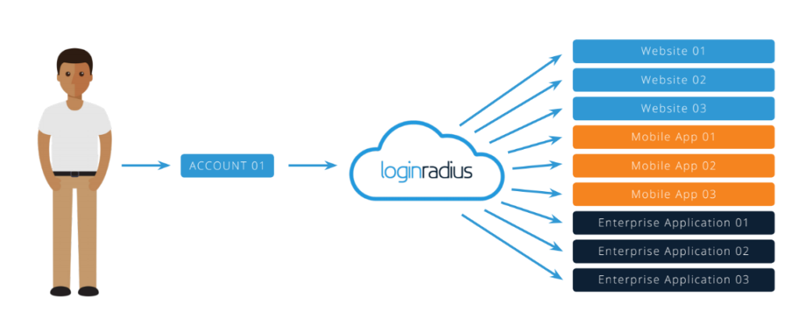
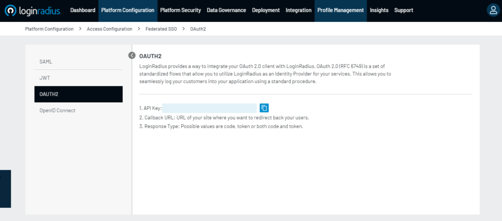

Introducing Single Sign On (SSO) to your customers can offer greater security and improved usability. That’s two of the many key [benefits of SSO.](https://www.loginradius.com/blog/2019/11/benefits-single-sign-on-sso/)

Let’s face it. No one likes remembering credentials. They seem like exerting a lot of pressure on the memory. What's worse is many use the same username and password, irrespective of the application they are using.

This is where the Single Sign On technology comes into focus and works like a champ. To understand this solution, let's consider an analogy:

"Imagine going to the mall, and at each store, you must register with the store for your first purchase. Then, every time after that, you have to prove who you are to buy something."

Unfortunately, this is what happens when you shop online. Each website makes you create a new and unique identity specific to that website. On top of that, you have to login and authenticate each time.

While some web properties do offer the option to [sign in using social identity](https://www.loginradius.com/social-login/), the majority of customers still have to log in to each web property. This often happens even when the websites are part of the same parent organization. 

## What Is Meant by Single Sign-On

Single Sign-On (SSO)  is a method of authentication that allows websites to use other trustworthy sites to verify users. Single sign-on allows a user to log in to any independent application with a single ID and password.

SSO is an essential feature of an Identity and Access Management (IAM) platform for controlling access. Verification of user identity is important when it comes to knowing which permissions a user will have. The LoginRadius Identity platform is one example of managing access that combines user identity management solutions with SSO solutions.

## What Are the Benefits of Single Sign-On

Single Sign-On clearly minimizes the risk of poor password habits. Also, removing login credentials from servers or network storage can help a great deal in [preventing a cyber attack](https://www.loginradius.com/blog/2019/10/cybersecurity-attacks-business/). 

### Benefits for customers

- **Seamless user experience**: Customers can use a single identity to navigate multiple web and mobile domains or service applications.
- **Stronger password protection**: Because users only need to use one password, SSO makes generating, remembering, and using stronger passwords simpler for them.
- **Reduces customer time**: The time spent on re-entering passwords for the same identity. Users will spend less time logging into various apps to do their work. Ultimately it enhances the productivity of businesses.

### Benefits for Business

- **Improves conversions and revenue**: Customers can access all domains and services with a single active session.
- **Mitigates risk**: Accessing third-party sites (user passwords are not stored or managed externally) becomes risk-free.
- **Unifies customer profiles**: Creating a single instance of the customer data provides a centralized view of the [customer across all channels.](https://www.loginradius.com/customer-profiling)
- **Reduces IT costs**: Due to fewer help desk calls about passwords, IT can spend less time helping users to remember or reset their passwords for hundreds of applications.

## How to Choose a Secure SSO Solution

Your SSO solution must meet the basic needs to support IT needs. That means a stable solution and a highly functional one. Today, digital transformation relies on a platform for [Customer](https://www.loginradius.com/blog/2019/06/customer-identity-and-access-management/)  [Identity and Access Management](https://www.loginradius.com/blog/2019/06/customer-identity-and-access-management/) (CIAM), which includes SSO and other tools. So, here what you need to keep in mind while narrowing down your SSO solution. 

### 7 Key Points to Consider While Choosing a Secure Single Sign-On Solution   

- **Support for Developers**: Make sure your SSO solution provides adequate life-cycle management API support and SDKs for major platforms. 
- **Authentication**: What about the extra layer of security? Find out if it supports MFA, adaptive authentication, automatic forced authentication, and more. 
- **Federation**: Find out if you will be allowed to use any corporate identity provider you prefer. Make sure it supports Microsoft Active Directory, Google Directory, etc. 
- **Mobile phones ready**: Ensure that your identity platform supports SSO for mobile devices and syncs well with various [multi-factor authentication](https://www.loginradius.com/blog/2019/06/what-is-multi-factor-authentication/) tools. 
- **Flexible rules governing passwords**: It should support password validation requirements like customizable password expiration limit, password complexity, and expiration notifications. 
- **Safety reputation**: Check out if it meets security standards like ISO 27017, ISO 27018, ISO 27001, SOC 2 Type 2, and global compliances like the [GDPR and CCPA](https://www.loginradius.com/blog/2019/09/ccpa-vs-gdpr-the-compliance-war/), etc.
- **Behavioral analytics**: Find out if it allows you to blacklist or whitelist IPs, set responses to counter brute force attempts and there are provisions for re-authentication.

## How Loginradius Single Sign-On Authentication Works

Single sign on (SSO) can be implemented in several ways, but typically follows a standard or protocol, as well as several technologies which can enforce the standards/protocols listed below.

### Web SSO

Web single sign-on enables your customers to access any of your connected web properties with a single identity. As customers navigate from one site to the next, your systems will be able to recognize who they are on each site.

[Web Single Sign-On](https://www.loginradius.com/docs/single-sign-on/web-and-mobile-sso/loginradius-web-sso/) also is known as LoginRadius Single Sign-On, is a browser-based session management system that uses browser storage mechanisms (sessionStorage, localStorage, Cookies) to hold the user session across your assets.

This storage is stored on a centralized domain managed by LoginRadius and can be accessed via our JavaScript Single Sign-On APIs, or directly through a JSONP call. This session is integrated seamlessly into our standard Customer Identity and Access Management scripts.

### Mobile SSO

Mobile single sign-on is like web SSO, except that customers can use a single identity to access connected mobile apps.

[Mobile SSO enables](https://www.loginradius.com/docs/single-sign-on/web-and-mobile-sso/loginradius-mobile-sso/) you to unify a user session across multiple apps that are serviced by a single account LoginRadius. It works by storing the LoginRadius access token in a shared session, either shared Android preferences or iOS keychain, which allows you to recognize a currently active session and access current user data sessions to configure your user account with each linked program.

### Federated SSO

Federated single sign-on [works a little differently](https://datafloq.com/read/what-is-federated-sso-is-it-different-from-sso/2700) than the web and mobile SSO. Rather than connecting websites or mobile apps, you use the login credentials held by partners. This happens by using industry-standard SSO protocols, which allow customers to gain access to web properties without authentication barriers.

LoginRadius also acts as an IdP that stores and authenticates the identities used by end-users to log in to customer systems, applications, file servers, and more depending on their configuration.

LoginRadius serves as a software provider providing end-user services. LoginRadius does not authenticate users but instead requests third-party Identity Provider authentication. LoginRadius relies on the identity provider to verify a user's identity and, if necessary, to verify other user attributes that the identity provider manages.

### SAML

Security Assertion Markup Language (SAML) is an open standard enabling identity providers (IdP) to pass credentials for authorization to service providers. In simple terms, it means that you can log into several different websites using one set of credentials.

[LoginRadius supports both SAML 1.1 and SAML 2.0](https://www.loginradius.com/docs/single-sign-on/federated-sso/saml/overview/) flows to support LoginRadius either as an IDP or as a Service Provider (SP). LoginRadius supports SAML flows, both initiated by IDP and initiated by SP. 

The LoginRadius Admin Console allows the SAML settings to be entirely self-service, allowing you to configure statements, keys, and endpoints to suit any SAML provider.

### JWT

JSON Web Token (JWT) is a commonly used Single Sign-On protocol widely used in B2C applications and included in RFC 7519. This protocol helps you to create an encrypted token that is encoded in JSON. In LoginRadius, this can either be created via API or directly requested through the responses to the Login and Social Login interface.

This token is then transferred and consumed on to the third-party service provider. The data to be collected can be mapped to the [LoginRadius Admin Console](https://www.loginradius.com/docs/single-sign-on/federated-sso/jwt-login/jwt-login-overview/). You can also configure the token's encryption method based on the service provider's specifications, which will consume the token.

### OAuth

OAuth is an open-standard authorization protocol or framework that describes how unrelated servers and services can securely enable authenticated access to their assets without actually sharing the initial, related, single login credential. This is known as safe, third party, user-agent, delegated authorization in authentication parlance.

LoginRadius may either function as an OAuth 2.0 Identity Provider or as a Service Provider delegating the authentication process to an IDP supporting the OAuth Project. The specifications for OAuth 2.0 are protected in RFC 6749.

Such specs cover the various specifications and [structured processes OAuth embraces](https://www.loginradius.com/docs/single-sign-on/federated-sso/oauth-2-0/oauth-2-0-overview/). From the authorization of the service provider requesting authentication to the request for authorization from the end-user to the generation of the access token used to request the scoped data from the IDP after authentication.

### OpenID Connect

OpenID Connect or (OIDC) is an authentication layer standardized by the OpenID Foundation atop the OAuth 2.0 framework. By following the specifications defined in the OpenID Connect specs, LoginRadius provides a way to integrate your [OpenID Connect client with our API](https://www.loginradius.com/docs/single-sign-on/federated-sso/openid-connect/openid-connect-overview/). These specs cover the various specifications and structured processes adopted by OpenID Link.

### Multipass

Multipass is one of the most simple forms of authentication with SSO. [Multipass is done](https://www.loginradius.com/docs/single-sign-on/federated-sso/multipass/) through the generation of an authenticated JSON hash of the values to be sent to the service provider.

## Conclusion

Deciding the best implementation method really depends on your individual situation, technical architecture, and business needs. 

If you think a [readymade SSO solution](https://www.loginradius.com/single-sign-on/) is best for your company, a customer identity provider like LoginRadius will help you achieve fast and easy implementation.

