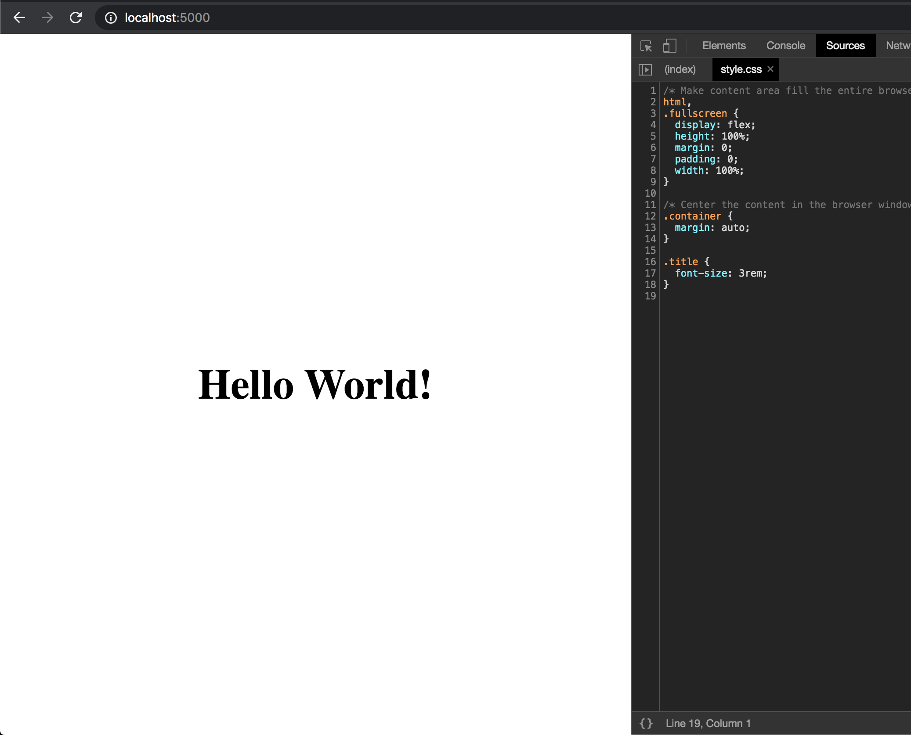
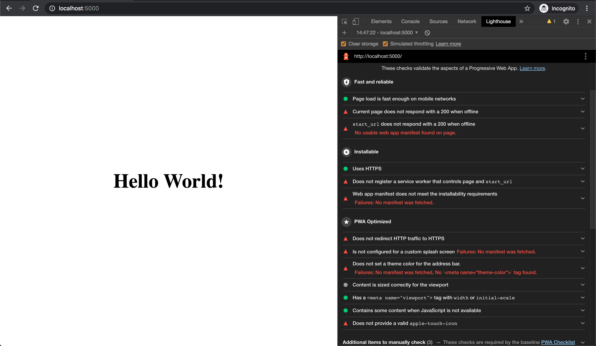
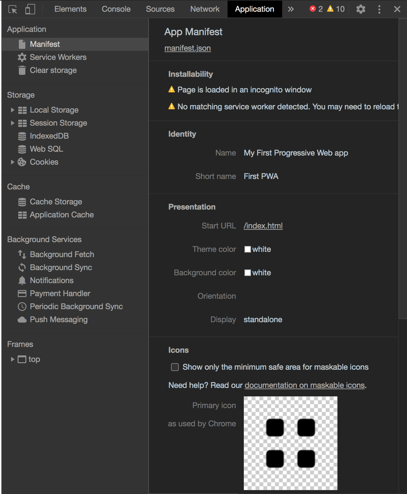
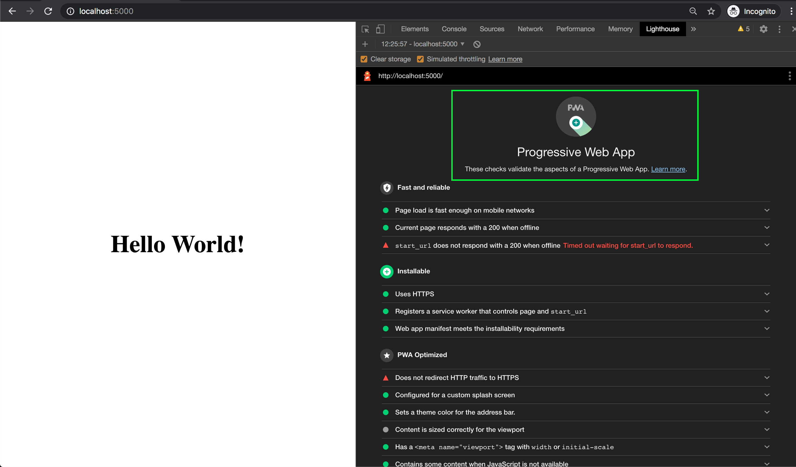

Today we will learn about the progressive web app, a very interesting and trending topic in current times, We will start with the basic steps first on how Progressive Web App works with vanilla js. Also, we’ll cover the concept of PWAS without using any of the frameworks, it's just a plain `vanillaJS`.

## What are Progressive Web Apps?

A Progressive Web app is an application which is built on top of _HTML_, _JS_ and _CSS_ with some extra features like `service worker` and `manifest.json` file. These extra features will give the ability to run the web application offline.

Various big companies are moving towards the progressive web app instead of native apps, as it gives some much flexibility to end-users. In some websites you can find the + icon at the right side of the address bar, those are progressive web apps.

## Setup your base app for PWA

We will be using `npm` to start our project, so firstly create a root folder using this command `mkdir first-pwa-app` or another name of your choice then go to that directory by using this command `cd first-pwa-app`. Run `npm init`

```sh
npm init

package name: (first-pwa-app)
version: (1.0.0)
description: This is the first PWA example
entry point: (index.js): index.html
test command:
git repository:
keywords:
author: Mohammed Modi
license: (ISC)
```

Once you fill up those details your final output of the `package.json` file will be below

```JSON
{
  "name": "first-pwa-app",
  "version": "1.0.0",
  "description": "This is the first PWA example",
  "main": "index.html",
  "scripts": {
    "test": "echo \"Error: no test specified\" && exit 1"
  },
  "author": "Mohammed Modi",
  "license": "ISC"
}
```

After that, we need to install the `serve` dependency to serve the application in localhost so install it using npm `npm i serve --save`. And then add a script in the `package.json` file.

```JSON
{
  ...
  "scripts": {
    "test": "echo \"Error: no test specified\" && exit 1",
    "serve": "serve ."
  },
  ...
}
```

So finally our application is ready to serve in localhost. Now let's add some `html` and `css`

### Setting up the Javascript

Create a directory for the app and add js, css, and images subdirectories. It should look like this when you’re finished:

```
/first-pwa-app   # Project Folder
    /css     # Stylesheets
    /js      # Javascript
    /images  # Image files.
    package.json
    package-lock.json
    index.html
    manifest.json
    sw.js
```

You will understand the use of `manifest.json` and `sw.js` files once we move ahead in this tutorial.

### Add Some code for app interface

When writing the code for Progressive Web Application we need to keep in mind two requirements

1. The landing page should have some content even if the javascript is not loaded
1. The App should be responsive and can be properly interactive in any device.

For this app, to handle the first requirement we will add the static text in the Html page and for the second requirement, we will use the [viewport](https://developer.mozilla.org/en-US/docs/Mozilla/Mobile/Viewport_meta_tag).

So let's add this code inside the `index.html` file.

```html
<!DOCTYPE html>
<html lang="en">
  <head>
    <meta charset="utf-8" />
    <title>My First PWA</title>
    <link rel="stylesheet" href="css/style.css" />
    <meta name="viewport" content="width=device-width, initial-scale=1.0" />
  </head>
  <body class="fullscreen">
    <div class="container">
      <h1 class="title">My First PWA!</h1>
    </div>
  </body>
</html>
```

Next, we need to create a file `css/style.css` and paste this code inside this

```css
body {
  font-family: sans-serif;
}

/* Make content area fill the entire browser window */
/* Make content area fill the entire browser window */
html,
.fullscreen {
  display: flex;
  height: 100%;
  margin: 0;
  padding: 0;
  width: 100%;
}

/* Center the content in the browser window */
.container {
  margin: auto;
}

.title {
  font-size: 3rem;
}
```

Once you add the code save all the files and run the script `npm run serve` which will start your application in http://localhost:5000/



### Testing the App

As we can see our application is running in the browser, let test it using the [LightHouse Extension](https://chrome.google.com/webstore/detail/lighthouse/blipmdconlkpinefehnmjammfjpmpbjk?hl=en) in Google Chrome browser. For the best result, I recommend testing in an **incognito tab** of google chrome.



As you can see we have green signals for both of our above requirement:

1. Has a <meta name="viewport"> tag with width or initial-scale
2. Contains some content when JavaScript is not available

But still, there is lots of work to do, so let's start with the first feature of PWA's.

### Adding a Web App Manifest

Let's create a new file called `manifest.json` in the root of our application. To understand more about the manifest file check out [this doc]

```json
{
  "name": "My First Progressive Web app",
  "short_name": "First PWA",
  "lang": "en-US",
  "start_url": "/index.html",
  "display": "standalone",
  "background_color": "white",
  "theme_color": "white"
}
```

Now update the `index.html` head tag by adding the manifest.json file as a link

```html
<head>
  ...
  <link rel="manifest" href="/manifest.json" />
  ...
</head>
```

We should also declare the theme colour which should match with your manifest.json file as `meta tag`.

```html
<head>
  ...
  <meta name="theme-color" content="white" />
  ...
</head>
```

Once you run the lighthouse test again you can see we got green signals in some points like

1. Sets a theme colour for the address bar.


### App Icons

Still, we need to add more attributes to our `manifest.json` files like **icons** so let's add the icons inside the `images` folder, I have used to icons `pwa-icon-256.png` and `pwa-icon-256.png` for this demo you can find in this repo. You can use various sizes in it. And finally, add the `favicon.png` in the root of the project.

So let's add the `icons` attribute after the `short-name`

```json
{
  "name": "My First Progressive Web app",
  "short_name": "First PWA",
  "icons": [
    {
      "src": ".images/pwa-icon-256.png",
      "sizes": "256x256",
      "type": "image/png"
    },
    {
      "src": ".images/pwa-icon-512.png",
      "sizes": "512x512",
      "type": "image/png"
    }
  ],
  "lang": "en-US",
  "start_url": "/index.html",
  "display": "standalone",
  "background_color": "white",
  "theme_color": "white"
}
```

And the index.html will head can will look like

```html
<head>
  ...
  <link rel="apple-touch-icon" href="images/pwa-icon-256.png" />
  ...
</head>
```

You can also verify the `manifest.json` file by opening Chrome DevTools, in the **Application Tab**, the first tab in the sidebar **manifest**



After running the test again, we can see all the `manifest.json` related issues are solved, The remaining issues can be resolved by adding the service worker.

### Adding Service Worker

The next requirement of our app will be the service worker. The service worker is a script that runs in the background without any user interaction.

The task of service worker will be to download and cache our content and then serve it when the user is offline. To understand more on service workers you can check this doc [from mozilla](https://developer.mozilla.org/en-US/docs/Web/API/Service_Worker_API).

To integrate service workers we need to create a file called `sw.js` in the root of our project.

> **Note**: Service worker will only have the access to the files of the **current and sub-directories** hence we need to place it in the root of our project

```javascript
let cacheName = "my-first-pwa"
let filesToCache = ["/", "/index.html", "/css/style.css", "/js/main.js"]

/* Start the service worker and cache all of the app's content */
self.addEventListener("install", e => {
  e.waitUntil(
    caches.open(cacheName).then(function (cache) {
      return cache.addAll(filesToCache)
    })
  )
})

/* Serve cached content when offline */
self.addEventListener("fetch", e => {
  e.respondWith(
    caches.match(e.request).then(response => {
      return response || fetch(e.request)
    })
  )
})
```

The first 2 variables `cacheName` and `filesToCache` are used to create an offline cache in the browser. `cacheName` is used to create a cache of specific name and `filesToCache` will be the list of files that we need to cache, `/` will store the root files that is `index.html` even if the user does not specify the file name in the URL and then all other files specified in the array.

> **Note**: Here I have used the `filesToCache` array as a list of static files just to demonstrate the purpose of PWA, it will stop working in production if even one file fails to load.

Finally, we will load our service worker, for that create `js/main.js` file and copy the below code.

```js
window.onload = () => {
  "use strict"

  if ("serviceWorker" in navigator) {
    navigator.serviceWorker.register("./sw.js")
  }
}
```

And add this script in the `index.html` file.

```html
...
<script src="js/main.js"></script>
```

So the final version of our `index.html` file will look like:

```html
<!DOCTYPE html>
<html lang="en">
  <head>
    <meta charset="utf-8" />
    <title>Hello World</title>
    <link rel="apple-touch-icon" href="images/pwa-icon-256.png" />
    <link rel="stylesheet" href="css/style.css" />
    <link rel="manifest" href="/manifest.json" />
    <meta name="viewport" content="width=device-width, initial-scale=1.0" />
    <meta name="theme-color" content="white" />
  </head>
  <body class="fullscreen">
    <div class="container">
      <h1 class="title">Hello World!</h1>
    </div>
    <script src="js/main.js"></script>
  </body>
</html>
```

Now our application is made as fully PWA supported, you can verify it by running the lighthouse test.



#### Finishing Up

We are done with the code, now the last thing remaining in to host it in any of the `https` domain. As the PWA will be required to run in [the secure domain](/everything-you-want-to-know-about-authorization-headers/).

You can get the full source code of this example in this [Github repo](https://github.com/LoginRadius/engineering-blog-samples/tree/master/ProgressiveWebApp/MyFirstPWA)

I hope you enjoyed the progressive web apps using vanilla js tutorial and found it useful. Please let me know what you think in the comments below.
