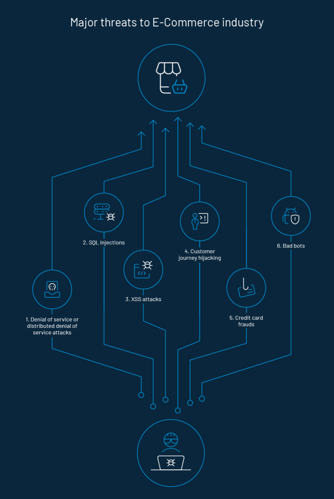
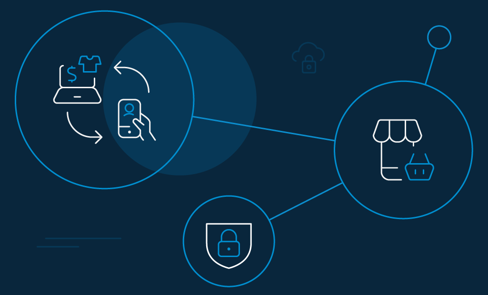

E-commerce security is a set of protocols that ensures safe transactions through the internet. In digital security, significant data breaches have profoundly undermined trust. Consumers are comfortable making purchases through common networks. However, they require a little more convincing when it comes to sharing their credit card data with unfamiliar companies.

By 2021, [over 2.14 billion people worldwide](https://www.statista.com/statistics/251666/number-of-digital-buyers-worldwide/) are expected to buy goods and services online. Increased online buying means retail data breaches will also be on the rise as point-of-sale (POS) systems, e-commerce sites and other store servers are major targets for hackers.

The biggest long-term consequence of a data breach is the loss of consumer trust which will have a direct effect on sales and destroy the retailers’ credibility.

## Current Statistics On Data breach 

Data breach refers to a security incident in which personal information is publicly exposed or accessed without authorization. 

Cybercrime Magazine predicts that retail will be one of [the top 10 most attacked industries](https://cybersecurityventures.com/cybersecurity-almanac-2019/) for 2019–2022. 

A few recent data breaches include:

- In March 2020, Marriott announced that [data of 5.2 million guests](https://news.marriott.com/news/2020/03/31/marriott-international-notifies-guests-of-property-system-incident) have been accessed using the login credentials of two employees at a franchise property.
- In May 2020, low-cost airline EasyJet revealed that a "highly-sophisticated attacker" [stole nine million consumers' personal data](https://www.bbc.com/news/technology-52722626#:~:text=EasyJet).
- A single [ransomware attack at Blackbaud](https://www.idtheftcenter.org/blackbaud-ransomware-attack-significantly-impacts-q3-data-breach-trends/?utm_source=web&utm_medium=pressrelease101420&utm_campaign=Q32020BreachTrends) exposed information from at least 247 organizations that have issued their own breach notices as of September, 2020. Of the 247 organizations to issue breach notices to their consumers, only 58 have disclosed the number of individuals impacted by the breach – 6,981,091. 
- A [study by KPMG](https://www.retaildive.com/news/survey-19-of-consumers-would-avoid-a-retailer-after-security-breach/425006/) states that 19% of consumers would completely stop shopping at a retailer after a breach and 33% would take a break from shopping there for an extended period.

The above statistics have serious implications for online retailers, mainly when trust and consumer confidence in your brand is the only way to ensure success. 

## Top 5 E-commerce Platforms for Online Businesses

It is very difficult to find the right ecommerce platforms for online business. Factors like popularity, overall ranking, features, consumer service, pricing, and ease of use play an important role in selecting the best e-commerce platforms. 

Based on these factors a few e-commerce platforms are mentioned below:

### Shopify 

Shopify is one of the best e-commerce sites and caters to businesses of all sizes. One of the most crucial reasons for their success is its flexibility. There are more than 2,400 apps in the Shopify App Store. It includes a built-in CMS, multiple themes for your site, a third-party marketplace and capability for a blog for your online store. Apart from the standard Shopify, Shopify Lite is for those with an existing website that needs a platform to take payments. 

### Bigcommerce

BigCommerce, as a leading open SaaS solution provides merchants sophisticated enterprise-grade functionality, customization, and performance with simplicity and ease-of-use. It has two offerings: BigCommerce Essentials (a DIY SaaS platform) and BigCommerce Enterprise (a customized experience for larger consumers). More than 800 apps in the BigCommerce app store allow you to add numerous additional capabilities to your store. Its multi-currency features allow merchants to set prices in multiple currencies and also settle in more than one currency.

### Magento

Magento is best for small-to-medium businesses that have already established demand, as well as the time, manpower and skill to build their own site. The platform is very powerful and has a library of over 5,000 extensions. Being open source, it targets people with professional web development experience. Magneto exists in two versions: Magento Open Source and Magento Commerce.

### Wix

Wix.com is a cloud-based website builder that allows users to create online stores through drag-and-drop tools. It has an extensive range of templates and designs that make it easy to build a compelling and functional website. Its website builder and ecommerce component is very user-friendly. It also provides a large selection of templates to fit various business needs. Wix.com’s ecommerce functionality has most of what a business would need, but doesn’t scale as well as dedicated platforms like Shopify or Magento.

### WooCommerce

WooCommerce is a free, open-source WordPress shopping cart plugin owned and developed by WordPress. It is suitable for small businesses that operate on a tight budget but still want a robust online store. However, you will have to separately purchase hosting, a domain name, and an SSL certificate, all of which are catered for by many of the stand-alone e-commerce platforms. WooCommerce allows unlimited products and product variants, including digital products.

## Security Threats That E-Commerce Stores Face

Ecommerce security for e-commerce is a must-have and consumers need to be constantly reassured about the safety measures that have been taken to mitigate a security threat. Features which an e-commerce security needs to adapt are:

1. **Invisible security** – The website works fast and returns minimal errors. The e-commerce site should implement website speed optimization, use a faster DNS provider and reduce image sizes. 

2. **Visible security** – Trust signals are visuals and graphics that make the consumers feel safe when they shop from an online e-commerce site. Few trust signals like About us page, branding, consumer testimonials, secure payment gateways and guarantees would help.

Both invisible and visible security help build trusting consumer relationships. 

Cybersecurity is a crucial feature which needs to be implemented by the e-commerce industry.  Without proper [security practices](https://www.loginradius.com/blog/2019/10/cybersecurity-best-practices-for-enterprises/) put into practice online retailers will put themselves and their consumers at high risk for data breach.  

Some of the types of threats faced by e-commerce are mentioned below:

1. **Denial of Service or Distributed Denial of Service attacks**

A distributed denial-of-service (DDoS) attack occurs when multiple machines are operating together to attack the e-commerce site and server. They are flooded with malicious queries that stop the site from working properly making the website inoperable. These attacks are disruptive, costly and affect overall sales.

2. **SQL injections**

SQL injections are cyber-attacks used to manipulate backend databases and access information that was not intended to be displayed. They can inject rogue code into the database to data as well as delete it. 

3. **XSS attacks**

Cross site scripting (XSS) is a type of attack in which malicious scripts are injected into the websites and web applications for the purpose of running on the end user's device. 

4. **Customer journey hijacking**

Customer journey hijacking (CJH) is a customer-side phenomenon whereby unauthorized advertisements are injected into consumers’ browsers. The injected advertisements can include product ads, pop-ups, banners and in-text redirects. 

5. **Credit card frauds**

Credit card fraud is the unauthorized use of a credit or debit card to make a purchase. The card numbers can be stolen from unsecured websites or can be obtained in an identity theft scheme.

6. **Bad bots**

Bad bots are designed to perform a variety of malicious jobs. They are capable of stealing content from the website, such as product reviews, product pricing, catalogs and so on which they publish on some other site. This affects the search engine ranking of the retailers' website. Bad bots are able to make multiple page visits within a very short span of time thus straining Web servers, which makes the site slow for genuine users.

## 5 Ways E-Commerce Can Keep Their Online Stores Safe Using Identity Management

1. **Renew SSL certificates and ensure total PCI compliance.**

SSL is the de facto standard for securing online transactions and essential to establish secure connectivity between the end-user systems and your e-commerce website. With SSL certifications in place, one can move from HTTP to HTTPS, which serves as a trust signal and prerequisite for consumers to provide their personal details and credit card information. 

Payment Card Industry Data Security Standard (PCI DSS or PCI) is an industry standard that ensures credit card information collected online is being transmitted and stored in a secure manner. E-commerce websites need to maintain PCI compliance. 

2. **Encourage your consumers to go passwordless while accessing their accounts**

In the retail industry, registering or logging in without a password calls for consumer retention and loyalty. By enabling the one-touch login feature, consumers can log in with a [magic link or OTP](https://www.loginradius.com/blog/2020/10/loginradius-launches-passwordless-login-with-magic-link-or-otp/) sent to their mobile number or email id.

3. **Prominently display payment trust signals and logos on your payment pages.**

Prominently displaying payment trust signals and logos on payment pages shows the consumer the security measures taken by the e-commerce website. Consumer privacy is critical in e-commerce. E-commerce sites should only collect data that is useful for the purposes of fulfilling the transaction. 

4. **Verify card and address details to reduce the risk of fraudulent transactions**

In order to risk fraudulent transactions, e-commerce websites need to verify card and address details of consumers. Usage of unique tracking numbers for every transaction helps to combat chargeback fraud. Geo-targeting can also help eliminate fraudulent transactions. 

5. **A secure login form to prevent credential attacks**

By implementing [multi-factor authentication (MFA)](https://www.loginradius.com/blog/2019/06/what-is-multi-factor-authentication/), retailers would be able to ensure that digital consumers can be authenticated. This method requires the consumer to provide two or more verification factors to gain access to the online account. 

## How LoginRadius Enhances E-Commerce Security With Its Advance CIAM Solution 

LoginRadius is a customer identity and access management tool that offers a seamless and secure way to access customer information – in your case, shoppers’ data. 

The [LoginRadius identity solution](https://www.loginradius.com/industry-retail-and-ecommerce/) provides a centralized, available, and secure identification and management of customers’ data to retailers. 

A few of LoginRadius solutions are mentioned below:

- Real-time ability for visitors to self-register for services
- Login and authenticate
- Enjoy a single-source view

With LoginRadius, you can get 360-degree customer profiling, with 100% customer consent, across all touch points. This allows you to personalize marketing and loyalty programs that engage your audience. 

## Conclusion     

Consumers want to shop with [e-commerce retailers](https://www.loginradius.com/blog/2020/04/loginradius-ciam-retail-ecommerce-business/) whom they can trust. When they enter their personal information, like credit card numbers or other banking details, they expect it to be well protected. By implementing proper e-commerce security safeguards, you can protect your business and consumers from online threats. 

