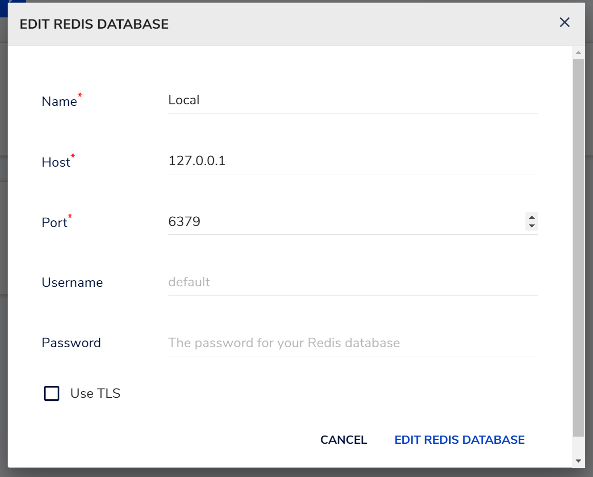
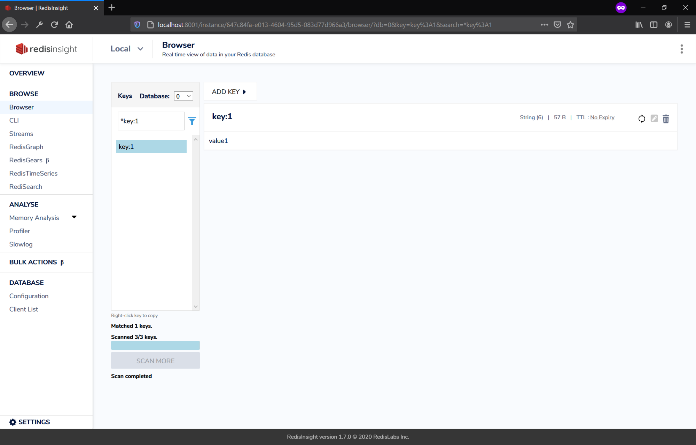

## Introduction

Redis's usage as both a temporary data store and even as a permanent data store is increasing today, as memory has started becoming much cheaper. Redis' quick memory-based CRUD operations allow database interactions to happen significantly faster than interactions with other databases that use drive-based storage. This blog is about three different methods to interact with your Redis data.

This blog will require having access to a Redis instance. Guides can be found to set up a local Redis instance for Windows [here](https://redislabs.com/blog/redis-on-windows-10/) and for UNIX based machines like Mac or other Linux distros, it can be found [here](https://redis.io/topics/quickstart). Alternatively, you can use a remote instance, but be aware that some of the commands in this blog may delete or modify the data.

## Redis Insight

For users that do not like working with command-line interfaces, the first tool introduced in this blog is a GUI interface called RedisInsight. This can be found [here](https://redislabs.com/redis-enterprise/redis-insight/). After filling in their download form and installing, running the application will start a server on the localhost, which you can access with a browser.

After installing and running the application, you will add the connection information for your Redis instance. If running a local instance of Redis, the connection information in the image will typically suffice. If connecting to a remote instance, you might need to fill in some additional details for TLS, such as connection certificates.



When connected to your Redis instance, the dashboard UI appears. Clicking the Browser sidebar tab will display all existing keys in your database.


From here, CRUD operations are relatively straightforward. Key-value pair creation can be done by using the ADD KEY button. This will prompt for the type of key-value pair to be added (Hash, String, JSON, etc.) and the data that will be stored with the key.

If a specific key is required to be queried, fill in the field next to the blue filter icon with search criteria, then click the icon. It will prompt the type of data stored with the key, and the results will be displayed.



Finally, keys can be deleted by clicking the trash can icon on the right side.

## Redis CLI

The Redis command-line interface is a more common approach for developers to interact with data from a Redis store. If you followed the steps at the beginning of the blog, the CLI should already be installed. To do a ping test to the server, type the following command in the terminal:

```console
chris@LR-ENG-17:~$ redis-cli -h localhost -p 6379 ping
PONG
```

And to connect, run the previous command without pinging:

```console
chris@LR-ENG-17:~$ redis-cli -h localhost -p 6379
localhost:6379>
```

The basic command to get a key-value pair is to call get with the key:

```console
localhost:6379> get key:1
"value1"
```

Setting a value can be done with the set command:

```console
localhost:6379> set key:1 value1new
OK
localhost:6379> get key:1
"value1new"
```

Creating a value can also be done in the same way:

```console
localhost:6379> get key:3
(nil)
localhost:6379> set key:3 value3new
OK
localhost:6379> get key:3
"value3new"
```

And deletion can be done with the del command:

```console
localhost:6379> del key:3
(integer) 1
localhost:6379> get key:3
(nil)
localhost:6379>
```

This is only the simple basics of the Redis CLI. You can do more advanced operations through the CLI, such as the flushall command, which wipes your database. It’s a powerful tool, so be careful when experimenting with it. An extensive list of commands can be found [here](https://redis.io/commands).

## With Your Chosen Programming Language

With Redis’ widespread usage, almost all major industry programming languages have either community or official supported releases of libraries that can be used to interact with your database. In this section, I will be using Node.JS, and one of the support Redis libraries called [node-redis](https://github.com/NodeRedis/node-redis).

Initialization of the package in the code can be done by calling the following command after initializing Node in your directory:

```console
npm install redis
```

When the process is finished, the `redis` module should be imported within your code, where you can set up the Redis connection and any options that need to be included:

```javascript
const redis = require("redis")

const redisOption = {
  host: "127.0.0.1",
  port: "6379",
}

const client = redis.createClient()
```

For an extensive list of options supported by the library for connection, check this [link](https://github.com/NodeRedis/node-redis#API).

After connecting, calling the `on` method on the client will allow the connection to open and run commands.

The commands used by the library are a 1 to 1 mapping of the commands used by the Redis CLI, so they follow the same method calls. To update or create an entry in Redis, the most basic method is to use the set command:

```javascript
client.set("key:3", "value3new")
```

Getting a value can be done with the get method:

```javascript
client.get("key:3")
```

Deleting a value can be done with the del method:

```javascript
client.del("key:3")
```

The methods used by the client also support callbacks. For example, if the operations should be console logged, we can include a callback to `redis.print` after each method:

```javascript
client.set("key:3", "value3new", redis.print)
client.get("key:3", redis.print)
client.del("key:3", redis.print)
```

The output of this in the console would be:

```console
Reply: OK
Reply: value3new
Reply: 1
```

## Conclusion

This blog has only touched the surface of the different operations Redis can do. There are many more resources online that can help you go further into your understanding of Redis. Whether using Redis as a temporary store, like a cache, or using it as a primary, permanent store, the operations' speed is something to be acknowledged and considered when building your next big app.
