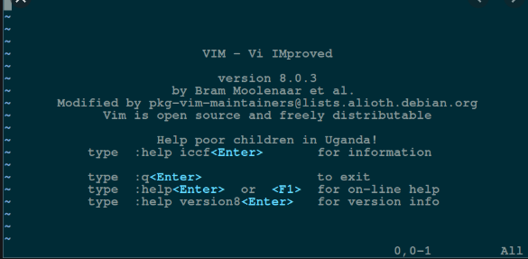
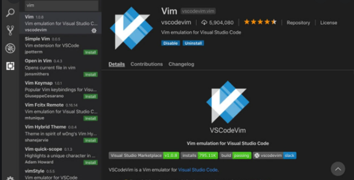
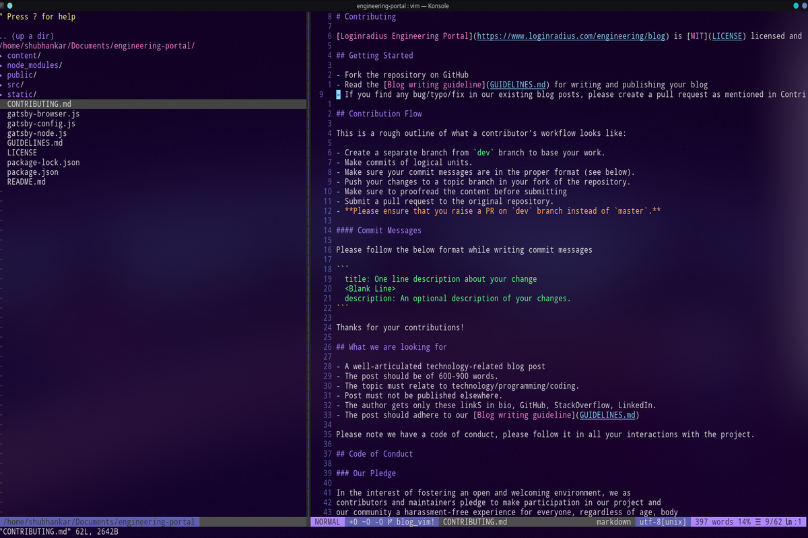

The acronym for Vim is Vi IMproved. Written by [Bram Moolenaar](https://en.wikipedia.org/wiki/Bram_Moolenaar), it is a free and open-source text editor. It was first released for UNIX variants in 1991, and its primary purpose was to develop the Vi editor, which was released back in 1976.

Vim is Vi's newest and most popular reincarnation that supports both text and graphical interfaces and is supported on any known platform.

The issue with learning Vim is not that it's challenging to do. It's that you have to continue to do it. This guide aims to break the loop so that for the last time, you can learn it.

The purpose of this tutorial is to take you through every step of progress from understanding the philosophy of Vim. In short, in a way that sticks with you for a lifetime, we're going to master Vim.

Let's start off!
## What is Vim?
Vim is a text editor for Unix that comes with Linux, BSD, and macOS. It is known to be fast and powerful, partly because it is a small program that can run in a terminal (although it has a graphical interface). It is mainly because it can be managed entirely without menus or a mouse with a keyboard.

For the following five reasons, I feel people should use Vim:

1. It's omnipresent. You don't have to think about learning about several boxes with a new editor.
2. It is highly scalable. You can use it only to edit configuration files or become your entire forum for writing.
3. It has a shallow memory footprint.
4. It's command-centered. With a few commands, you can perform complex text-related tasks.
5. It is highly configurable and uses simple text files to store its settings.

## Why Use Vim?

In all POSIX systems, Vim is the default fallback editor. Vim is sure to be open, whether you have just installed the operating system, or you have booted into a minimal system repair environment, or you are unable to access any other editor. While you can switch out other tiny editors on your systems, such as GNU Nano or Jove, it's Vim that's all but guaranteed to be on every other system in the world.

In short, I think competence with Vim should be considered the way you view competence with your native language, or simple maths, etc. In technology, so much begins with understanding your editor.

Also, It is **extremely customizable** and you can adapt it to your way of coding and your way of doing things.
To give you a taste of vim , below are a few commands frequently used to code at lightning speed:

 - hjkl : move the cursor around to left, down, up, and right respectively.
 - 7j : move 7 lines down.
 - w : move a word forward
 - ctrl + f : move down a page
 - ctrl + b : move up a page
 - gg : move to the top of the document
 - G : move to the bottomost of the document
 - dw : delete a word
 - d6w : delete 6 words
 - dt> : delete till  `>`
 - di] : delete everything inside `[ ]`
 - dd : delete whole line
 - 4dd : delete 4 lines
 - yy : yank a line ( yank is copy )
 - cc : change a line ( change is delete and go in insert mode )
 - cap : change a paragraph
 - `.` : repeat last command
 - f' : find first occurance of `'`
 - f'ci'hello : _find the next  `'` then change everything inside `'` for `hello`

The list goes on and on... 

Basically we have standard keybindings like d for delete, c for change, f for find etc. and we can pair them with numbers to repeat that action n number of times. Moreover doubling a command like so `yy` makes the command operate on the entire line.


So to sum up,
>Vim is for **programmers who want to raise their game**. In the hands of an expert, It shreds text at the speed of thought.

 #### How to use Vim
 Well, there is a learning curve, but it's worth it. Although this steep curve is exaggerated in the online world and the **quitting vim joke** is getting very old (It's:q btw).

 Install Vim `sudo apt-get vim or pacman -S vim` for Linux user and type `vim <filename>` in your terminal. Press `i` to go to insert mode. Type some gibberish. Press `:wq` to save and quit . `:q!` to quit without saving.

 First of all, don't get disheartened when you see VIM for the first time, it's known to make a **horrible first impression.** We'll learn to customize it later in the blog.

 


 To get started, get your hands dirty on [**vimtutor**](http://www2.geog.ucl.ac.uk/~plewis/teaching/unix/vimtutor) . It's a 20-30 minute vim tutorial which teaches you all the basics. Just type `vimtutor` in your terminal (in a machine where you have vim installed) to open it.

**Try  [Vim Adventures](https://vim-adventures.com/)**. An interactive game that teaches you vim skills in a step by step manner and lets you unlock new abilities after you've proved your worth with the previous ones.

 Just get started with it . **Learn as you go** . You can always refer to the [Vim CheatSheet](https://vim.rtorr.com/) to get better. Practice makes a man perfect. Watch screencasts if that's helpful (was helpful to me).

## How do I configure my Vim ?

The best way to configure your Vim is through `.vimrc` file, which is hidden inside your home directory. Open a terminal and type `vim ~/.vimrc` to open your vimrc file using vim. Cool huh? Using vim to configure vim ..no? Nevermind!
Here you can define your keybindings, set themes, install plugins etc.

Here is an example of a custom keybinding
`map <C-n> :NERDTreeToggle<CR>
`
You can check out this [article](https://hea-www.harvard.edu/~fine/Tech/vi.html) on keybindings and how to use them.

The easiest way to download and manage plugins for vim is by using a plugin manager. There are quite a few [vim-pathogen](https://github.com/tpope/vim-pathogen) , [Vundle.vim](https://github.com/VundleVim/Vundle.vim) , [Vim-plug](https://github.com/junegunn/vim-plug) etc.
Vim-plug being my favourite. Installations and usage for each plugin manager can be found in their respective repositories.

I personally like to call all my plugins in a separate file and link that file to my vimrc. Paste this line in your vimrc at the top if you want to do the same `source ~/.vim/plugin/plugins.vim
`
 In your plugins.vim file you can install different plugins like this:-
 ```
 call plug#begin('~/.vim/plugged')

Plug 'scrooloose/nerdtree'
Plug 'moll/vim-node'
Plug 'yegappan/mru'

call plug#end()
```
The first and last lines are for vim-plug to know what plugins are to be installed. The lines beginning with `Plug` is to install that particular plugin.

Now just reload .vimrc (or quit vim and re-enter) and `:PlugInstall` to install plugins.

## What are some good plugins for Vim?
Glad you asked because Vim is no fun without plugins made by the awesome open source community.
Here are some good plugins you should definitely install. Just search these on GitHub in case you wanna know more about them or their usage.

 - scrooloose/nerdtree
 - alvan/vim-closetag
 - vim-scripts/vim-auto-save
 - airblade/vim-gitgutter
 - ervandew/supertab
 - vim-airline/vim-airline
 - SirVer/ultisnips
 - honza/vim-snippets
 - dense-analysis/ale
 - tpope/vim-repeat
 - ap/vim-css-color
 - jiangmiao/auto-pairs
 - tmhedberg/matchit
 - kana/vim-textobj-user
 - vim-scripts/tComment
 - Valloric/YouCompleteMe', { 'do': './install.py --tern-completer' }
 - prettier/vim-prettier', { 'do': 'yarn install' }
 - jeffkreeftmeijer/vim-numbertoggle
 - elzr/vim-json
 - tpope/vim-markdown
 - pangloss/vim-javascript
 - mxw/vim-jsx
 - jparise/vim-graphql
 - leafgarland/typescript-vim
 - vim-syntastic/syntastic
 - ntpeters/vim-better-whitespace

Pheww!!..
So you see there's a plugin for anything and everything. These plugins are more than enough to make vim a full-blown IDE.

### Summing up!!
VIM makes you write code at the speed of thoughts. Just get started, and the rest will follow. Steal your friend's vimrc or find one on the internet (there are tons of them) if you don't want to make one of your own.

If you want to slowly blend in into the world of vim then use some vim plugin for your text editor. All popular text editors have a vim plugin ( [Here's one for VsCode ](https://marketplace.visualstudio.com/items?itemName=vscodevim.vim))
Here you go, best of both worlds! When you're comfortable enough, go for that complete switch.



Here's how my vim setup looks.



Now go give it a try. I wish you luck!!
