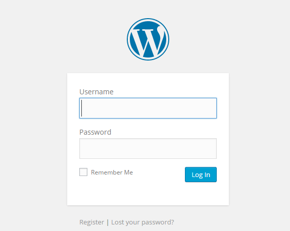

I often come across people and clients who would like to build their custom login, registration, and lost password form in WordPress instead of using the default wp-login.php page. It's probably because it's too wordpress-y.

In this tutorial, I will demonstrate how to build a custom login form using the default functionality that wordpress gives us.

- [Building a Custom Login Form](#buildlogin)
- [Handling the Login Form Response](#loginresponse)

## Building a WordPress Login Form (Out of the box)

This is what WordPress gives us out of the box.

  
There are quite a few different options available to make a custom login page. You can build a [shortcode](https://codex.wordpress.org/Shortcode_API) so that you could simply put \[wp-login\] or something you like on any page/post, make a page theme file and use that page to attach to a post/page, a widget could be a good solution too, or maybe you'd like to simply edit the existing form and add some pizzazz to it.

I am going to show you all of this tutorial using the page-theme method because it is probably the easiest to implement for beginners. This will also give you an intro into page themes, if your not familiar with it.

To start our theme, you will need to do the following:

1. Install WordPress
2. Navigate to your _wp-content/themes_ folder and choose a theme to edit or install a new one
3. create a file called _page-login.php_ in the theme directory
4. Next open that file with a text editor of your choosing and add the following at the top of the php file.
    
```php
&amp;amp;amp;lt;?php
/*
Template Name: Login
*/
 
get_header(); ?&amp;amp;amp;gt;
 
&amp;amp;amp;lt;div id="primary" class="content-area"&amp;amp;amp;gt;
&amp;amp;amp;lt;div id="content" class="site-content" role="main"&amp;amp;amp;gt;
 
&amp;amp;amp;lt;/div&amp;amp;amp;gt;&amp;amp;amp;lt;!-- #content --&amp;amp;amp;gt;
&amp;amp;amp;lt;/div&amp;amp;amp;gt;&amp;amp;amp;lt;!-- #primary --&amp;amp;amp;gt;
 
&amp;amp;amp;lt;?php get_sidebar(); ?&amp;amp;amp;gt;
&amp;amp;amp;lt;?php get_footer(); ?&amp;amp;amp;gt;
 ```
    

To initialize this page template, make sure to activate the theme you've selected in "Appearance/Themes" in your admin dashboard and then navigate to a page or post. On the right hand side of your page/post editor you should now see a dropdown available for template under "Page Attributes". Change your template to "Login" or to the name that you specified in "Template Name:" and that will attach that page theme to this page/post.

Now we're ready to start editing this page-login.php template file. So first open this file in your favorite editor and Let's get a login page started.

To quickly show you how to get this login on the page Let's paste the following code between the div with id of content.

```php
&amp;amp;amp;lt;div id="primary" class="content-area"&amp;amp;amp;gt;
&amp;amp;amp;lt;div id="content" class="site-content" role="main"&amp;amp;amp;gt;
&amp;amp;amp;lt;?php wp_login_form(); ?&amp;amp;amp;gt;
&amp;amp;amp;lt;/div&amp;amp;amp;gt;&amp;amp;amp;lt;!-- #content --&amp;amp;amp;gt;
&amp;amp;amp;lt;/div&amp;amp;amp;gt;&amp;amp;amp;lt;!-- #primary --&amp;amp;amp;gt;

```

Look at what that small piece of code do


Now we need to set some arguments that we can provide to this form to customize it. Let's take a look at the documentation for [wp_login_form()](https://developer.wordpress.org/reference/functions/wp_login_form/)

In that document, it explains all the uses and arguments of wp_login_form(). Let's use those arguments section and see what happens. Paste the $args section shown in the wordpress doc right above our login form.

```php
&amp;amp;amp;lt;?php $args = array(
'echo' =&amp;amp;amp;gt; true,
'redirect' =&amp;amp;amp;gt; ( is_ssl() ? 'https://' : 'http://' ) . $_SERVER['HTTP_HOST'] . $_SERVER['REQUEST_URI'],
'form_id' =&amp;amp;amp;gt; 'loginform',
'label_username' =&amp;amp;amp;gt; __( 'Username' ),
'label_password' =&amp;amp;amp;gt; __( 'Password' ),
'label_remember' =&amp;amp;amp;gt; __( 'Remember Me' ),
'label_log_in' =&amp;amp;amp;gt; __( 'Log In' ),
'id_username' =&amp;amp;amp;gt; 'user_login',
'id_password' =&amp;amp;amp;gt; 'user_pass',
'id_remember' =&amp;amp;amp;gt; 'rememberme',
'id_submit' =&amp;amp;amp;gt; 'wp-submit',
'remember' =&amp;amp;amp;gt; true,
'value_username' =&amp;amp;amp;gt; '',
'value_remember' =&amp;amp;amp;gt; false
); ?&amp;amp;amp;gt;
&amp;amp;amp;lt;?php wp_login_form( $args ); ?&amp;amp;amp;gt;
```

It will look the same as the one we did earlier but, by customizing the arguments above, you can customize elements of the login form.

## Handling the login form response (Custom)

To handle the Login Form response we need to grab the $_POST parameters and login the user. You can create this as complex as you like, but I will demonstrate a simpler but effective method.

For this action, we'll be using the **after_setup_theme** and **wp_authenticate**. I have added the following two functions within the functions.php file. The first function **optional_email_address_login** searches for a users email address based on their username, with this functionality you can log in using your email address or the username.

The second function, **login_user**, handles the actual functionality of the login by receiving the $_POST parameters and passing them into the wp_signon method.

```php
/**
* optional_email_address_login allows the user
* to log in with a email address as well as a username
* @param string &amp;amp;amp;amp;$username username or email
* @param string &amp;amp;amp;amp;$password password
*/
function optional_email_address_login( &amp;amp;amp;amp;$username, &amp;amp;amp;amp;$password ) {
$user = get_user_by( 'email', $username );
if ( ! empty( $user-&amp;amp;amp;gt;user_login ) )
{
$username = $user-&amp;amp;amp;gt;user_login;
}
}
// Allows the use of email logins
add_action( 'wp_authenticate', 'optional_email_address_login', 1, 2 );
 
/**
* login_user handles the $_POST array and logs in users
*/
function login_user() {
if ( ! is_user_logged_in() ) {
$creds = array();
$creds['user_login'] = isset( $_POST['log'] ) ? $_POST['log'] : '';
$creds['user_password'] = isset( $_POST['pwd'] ) ? $_POST['pwd'] : '';
$creds['remember'] = isset( $_POST['rememberme'] ) ? true : false;
$user = wp_signon( $creds, false );
 
if ( is_wp_error( $user ) ) {
error_log( $user-&amp;amp;amp;gt;get_error_message() );
}
}
}
// Run login_user before headers and cookies are sent
add_action( 'after_setup_theme', 'login_user' );
```

In this example I have used the default WordPress login form that you could customize and style to your desire. In the next blog, I will be demonstrating how to build a login form that is fully customized. We won’t be using the provided wordpress functions!
